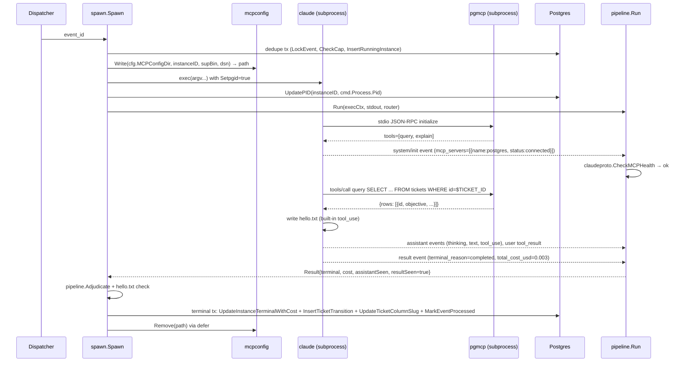

# Implementation plan: M2.1 — Claude Code invocation

**Branch**: `003-m2-1-claude-invocation` | **Date**: 2026-04-22 | **Spec**: [spec.md](./spec.md)
**Input**: Feature specification from `/specs/003-m2-1-claude-invocation/spec.md`
**Binding context**: [`specs/_context/m2.1-context.md`](../_context/m2.1-context.md), [`docs/research/m2-spike.md`](../../docs/research/m2-spike.md), [`AGENTS.md`](../../AGENTS.md) §§"Activate before writing code → M2.1" + "Stack and dependency rules" + "Concurrency discipline" (rules 6 and 7), [`RATIONALE.md`](../../RATIONALE.md) §§1, 2, 9, 11, 13, [`constitution.md`](../../.specify/memory/constitution.md), [`docs/retros/m1.md`](../../docs/retros/m1.md) including the addendum. The M1 supervisor (`supervisor/`) is the foundation this plan extends; its code and commit log are prerequisite reading.

## Summary

Extend the M1 supervisor to spawn real Claude Code subprocesses per M2.1's binding spawn, stream-json, and termination contracts, with an in-tree read-only Postgres MCP server wired per invocation, and a supervisor-adjudicated terminal transaction capturing cost, ticket transition, and event-outbox dedupe in one commit. The M1 dispatcher, LISTEN/poll machinery, concurrency accounting, advisory-lock single-instance guard, health endpoint, and recovery query are inherited unchanged; M2.1's code lands as new packages (`internal/claudeproto`, `internal/mcpconfig`, `internal/pgmcp`) plus targeted surgery to `internal/spawn`, `internal/config`, and a new `supervisor mcp-postgres` subcommand. The trigger emits qualified channel names; the supervisor LISTENs on `work.ticket.created.engineering.todo`. One forward migration adds `agent_instances.total_cost_usd`, creates the `garrison_agent_ro` role with `GRANT SELECT` on read-surface tables, widens the trigger to qualified channels, and seeds the engineering department and engineer agent. The Dockerfile gains a verified-manifest install of the pinned `claude` binary from `downloads.claude.ai` plus the Alpine musl dependencies the installer docs require.

## Technical context

**Language/Version**: Go 1.25 (inherited from M1).
**Primary dependencies**: inherited — `github.com/jackc/pgx/v5`, `github.com/jackc/pgx/v5/pgxpool`, `golang.org/x/sync/errgroup`, `log/slog`, `github.com/pressly/goose/v3`, `github.com/google/shlex` (the M1 soft-rule exception; no longer used by the real-Claude path but retained for test harnesses), `github.com/stretchr/testify`, `github.com/testcontainers/testcontainers-go`. No new dependencies are added; the in-tree Postgres MCP server uses only stdlib `encoding/json` over stdio plus `pgx/v5`.
**Storage**: PostgreSQL 17+ (unchanged from M1).
**Testing**: stdlib `testing` + `testify` + `testcontainers-go`; the M1 `integration` and `chaos` build tags are reused with M2.1 additions.
**Target platform**: Linux server (Hetzner + Coolify); single static binary via `CGO_ENABLED=0 go build`; Alpine 3.20 runtime base with `libgcc`, `libstdc++`, `ripgrep`, `ca-certificates`, `gpg` added so the Claude Code native binary runs on musl (per `docs.claude.com` setup page, "Alpine Linux and musl-based distributions").
**External binary**: `claude` CLI, pinned to version `2.1.117` in the Dockerfile, installed from `https://downloads.claude.ai/claude-code-releases/2.1.117/` with GPG-signed manifest verification. The spike characterized this exact version.
**Project type**: CLI/daemon; single Go module under `supervisor/` producing one binary with two entrypoints (`supervisor` — default, the dispatcher; `supervisor mcp-postgres` — the read-only Postgres MCP server spawned by Claude).
**Performance goals**: inherited M1 NFRs plus M2.1's 2-second MCP-bail latency (NFR-106), 60-second subprocess timeout measured from `cmd.Start()` (NFR-101, as clarified in session 2026-04-22), $0.05 per-invocation budget cap (NFR-103), concurrency cap of 1 for the engineering department (NFR-107).
**Constraints**: locked dependency list; no CGO in the supervisor binary; no Node/Python runtime in the supervisor; Postgres read-only role is the primary defense, MCP protocol-layer SQL filtering is defense-in-depth; process-group signalling only (no PID-level signals) for all Claude subprocesses (AGENTS.md concurrency rule 7); terminal writes use `context.WithoutCancel` (AGENTS.md concurrency rule 6 and M1 retro §2).
**Scale/scope**: single operator; one department; one agent role; sequential tickets (cap=1) expected during M2.1 validation; per-invocation cost < $0.005 target with cache hits (spike §2.4); tens of invocations per week at M2.1, not thousands.

## Constitution check

*Gate: must pass before planning proceeds. Re-checked before `/speckit.tasks`.*

| Principle | Compliance |
|-----------|------------|
| I. Postgres is sole source of truth; pg_notify is the bus | Pass — the supervisor is the sole writer; Postgres MCP is read-only; pg_notify continues to be the event bus (with qualified channel names from M2.1 on). |
| II. MemPalace is sole memory store | N/A — deferred to M2.2. M2.1 introduces no alternative memory layer. |
| III. Agents are ephemeral | Pass — every Claude invocation is a fresh subprocess, no persistence flags (`--no-session-persistence`), no pooled processes. |
| IV. Soft gates on memory hygiene | N/A — M2.1 has no expected-writes contract; `hygiene_status` stays NULL on every M2.1 transition. |
| V. Skills from skills.sh | N/A — M7. M2.1 engineer agent has `skills=[]`. |
| VI. Hiring is UI-driven | N/A — M7. M2.1 seeds the engineer agent via migration. |
| VII. Go supervisor with locked deps | Pass — no new dependencies; in-tree Go Postgres MCP server uses stdlib JSON and the already-locked pgx/v5. |
| VIII. Every goroutine accepts context | Pass — every new goroutine in this plan takes `ctx`; the NDJSON reader, event router, and MCP server all respect cancellation. |
| IX. Narrow specs per milestone | Pass — this plan implements the M2.1 spec exactly; MemPalace (M2.2), secret management (M6), dashboard (M3), hiring (M7), skills (M7), rate-limit backoff (M6) are all deferred and explicitly out-of-scope. |
| X. Per-department concurrency caps | Pass — M1's `internal/concurrency.CheckCap` is reused unchanged; the engineering seed row has `concurrency_cap=1`. |
| XI. Self-hosted on Hetzner | Pass — Dockerfile still targets Hetzner + Coolify; the Claude binary install fetches from Anthropic's published downloads at build time, not at runtime. |

No violations → Complexity Tracking intentionally empty.

## Project structure

### Documentation (this feature)

```text
specs/003-m2-1-claude-invocation/
├── spec.md                 # locked after clarify
├── plan.md                 # this file
├── checklists/
│   └── requirements.md     # quality checklist, all passing
└── tasks.md                # produced later by /speckit.tasks
```

Research, data-model, contracts, and quickstart artefacts that M1 maintained as sibling files are inlined into this plan's sections below. M2.1 is small enough that external artefacts add indirection without benefit; everything binding is in this document or in the already-existing `m2.1-context.md` and `m2-spike.md`.

### Source code (repository root) — M2.1 delta

```text
garrison/
├── supervisor/
│   ├── cmd/supervisor/
│   │   ├── main.go                      # wires new subsystems into errgroup
│   │   ├── migrate.go                   # unchanged
│   │   ├── signals.go                   # unchanged
│   │   ├── version.go                   # unchanged
│   │   └── mcp_postgres.go              # NEW — entrypoint for `supervisor mcp-postgres`
│   ├── internal/
│   │   ├── claudeproto/                 # NEW — NDJSON event types + router interface
│   │   │   ├── events.go
│   │   │   ├── router.go
│   │   │   └── init.go                  # init-event health-check logic (pure)
│   │   ├── mcpconfig/                   # NEW — per-invocation MCP config file lifecycle
│   │   │   └── mcpconfig.go
│   │   ├── pgmcp/                       # NEW — in-tree Postgres MCP server
│   │   │   ├── server.go                # JSON-RPC 2.0 over stdio
│   │   │   ├── tools.go                 # query / explain tool impls
│   │   │   └── auth.go                  # DSN composition + statement filter
│   │   ├── spawn/
│   │   │   ├── spawn.go                 # REWRITTEN body; process-group spawn, NDJSON drive
│   │   │   ├── template.go              # retained for test harness; not on real-claude path
│   │   │   ├── exitreason.go            # NEW — exit_reason constants + helpers
│   │   │   └── pipeline.go              # NEW — stdout/NDJSON reader, cost capture, adjudication
│   │   ├── config/config.go             # extended — new env vars, see §Config additions
│   │   ├── agents/                      # NEW — loads agent rows from Postgres (in-memory cache)
│   │   │   └── agents.go
│   │   ├── events/                      # unchanged (dispatcher registration updated at wire-up)
│   │   ├── concurrency/                 # unchanged
│   │   ├── pgdb/                        # unchanged
│   │   ├── recovery/                    # unchanged
│   │   ├── health/                      # unchanged
│   │   ├── store/                       # REGENERATED — new queries for M2.1 migration
│   │   └── testdb/                      # extended with M2.1 seed helpers
│   ├── Dockerfile                       # REWRITTEN — adds verified claude install + musl deps
│   ├── Makefile                         # extended — `make claude-version` target, sqlc target
│   ├── sqlc.yaml                        # unchanged
│   ├── go.mod                           # unchanged
│   └── go.sum                           # unchanged
├── migrations/
│   ├── 20260421000001_initial_schema.sql        # M1, unchanged
│   ├── 20260421000002_event_trigger.sql         # M1, unchanged
│   ├── 20260422000003_m2_1_claude_invocation.sql  # NEW — see §Migration
│   └── queries/
│       ├── departments.sql              # extended — by-slug lookup
│       ├── tickets.sql                  # unchanged
│       ├── event_outbox.sql             # unchanged
│       ├── agent_instances.sql          # extended — pid backfill, cost column, new exit_reasons
│       └── agents.sql                   # NEW — GetAgentByID, ListAgentsByDepartment
└── examples/
    └── agents/
        └── engineer.md                  # NEW — seeded into agents.agent_md by migration
```

**Structure decision**: extend, do not rewrite. M1's orchestration (errgroup, LISTEN/poll, dispatcher, concurrency cap, recovery, health, advisory lock) is reused as-is. New packages land alongside existing ones rather than replacing them. The binary is still single-static.

## Decisions baked into this plan (from /speckit.specify, /speckit.clarify, and operator sign-off)

The seven binding questions from `m2.1-context.md` were resolved in the spec and are restated here only so implementation has one place to find them:

| Question | Commit |
|---|---|
| Postgres MCP implementation | In-tree Go, stdlib JSON over stdio, in `internal/pgmcp`, invoked via `supervisor mcp-postgres` subcommand. No new deps. |
| Read-only enforcement | Postgres role `garrison_agent_ro` with `GRANT SELECT` on the read surface; MCP protocol-layer rejects non-SELECT/EXPLAIN as defense-in-depth. |
| Subprocess timeout default | 60 s; clock starts at `cmd.Start()` per clarify session 2026-04-22. |
| Per-invocation budget cap | $0.05 via `--max-budget-usd 0.05`. |
| MCP config file location | `<GARRISON_MCP_CONFIG_DIR>/mcp-config-<agent_instance_id>.json`, default dir `/var/lib/garrison/mcp/`. |
| Engineer `agent.md` delivery | Inline in `agents.agent_md`; `examples/agents/engineer.md` is the seed and the open-source bootstrap example. |
| Engineering concurrency cap | 1 (seed value on the row). |

The three clarify-session answers (session 2026-04-22) are similarly encoded:

| Clarify question | Commit |
|---|---|
| Timeout start-of-clock | `cmd.Start()`. The 2-s MCP-bail budget runs inside the 60-s window; there is no separate pre-init timer. |
| MCP config file write failure | Record-and-continue — `exit_reason='spawn_failed'`, event marked processed, dispatcher keeps running, no retry. |
| Subprocess exit without parsed `result` | Fail-closed — `exit_reason='no_result'`, no ticket transition, regardless of exit code. |

## Changes to existing M1 packages

One paragraph per package; states the diff, not a reimplementation.

### `internal/config`

Adds fields and env-var loaders for M2.1:

- `ClaudeBin string` — absolute path to the `claude` binary. Loaded via `GARRISON_CLAUDE_BIN`; if empty, `exec.LookPath("claude")` at startup. Fail-fast with error `"config: cannot find claude binary on $PATH and GARRISON_CLAUDE_BIN is unset"`.
- `ClaudeModel string` — default model override, read from `GARRISON_CLAUDE_MODEL`. If empty, the supervisor uses the model column on the agent row (which defaults to `claude-haiku-4-5-20251001` per the seed). Intentionally a two-layer fallback so an operator can force a model across agents without editing the DB, but normally the per-agent DB value wins.
- `ClaudeBudgetUSD float64` — `GARRISON_CLAUDE_BUDGET_USD`, default `0.05`. Must be `> 0` and `< 1.00`; validator rejects anything outside.
- `MCPConfigDir string` — `GARRISON_MCP_CONFIG_DIR`, default `/var/lib/garrison/mcp/`. Validator checks the directory exists and is writable after `os.MkdirAll`; fail-fast on error. Used by `internal/mcpconfig`.
- `AgentROPassword string` — `GARRISON_AGENT_RO_PASSWORD`, required (no default). Composed into the read-only DSN handed to the in-tree MCP server. The supervisor itself uses its own superuser-or-equivalent connection; this field is never used for supervisor-to-Postgres traffic.
- `AgentRODSN string` — **derived**, not an env var. The supervisor builds this from `DatabaseURL` (swap the username/password path for `garrison_agent_ro` / `AgentROPassword`) at startup. Kept private to `internal/config` via an unexported field exposed via `(*Config).AgentRODSN() string`.
- `SubprocessTimeout` — the existing M1 field is reused. Default remains 60 s; spec NFR-101 and clarify-session-Q1 confirm the semantic is "from `cmd.Start()`" which is already how M1's `exec.CommandContext` behaves. No code change needed beyond this comment on the constant.

Validation order in `Load` places `MCPConfigDir` writability check after env parsing so the error message is grouped with the other startup validations. `ClaudeBin` resolution runs at the end so a missing `claude` binary produces a specific error message rather than a generic config error.

Removed: `FakeAgentCmd` is retained in `config.Config` only so existing M1 integration tests can still flip the supervisor into fake-agent mode (test-only escape hatch). A new `Config.UseFakeAgent bool` flag, default `false`, keyed off whether `GARRISON_FAKE_AGENT_CMD` is set, lets production builds keep a clean code path while tests continue to exercise the M1 mock pipeline where it's more convenient than mocking Claude Code. The fake-agent code path in `internal/spawn/template.go` stays as-is and is gated by this flag.

### `internal/spawn`

The body of `Spawn()` is rewritten. New flow:

1. **Dedupe transaction** — unchanged from M1 (`LockEventForProcessing` → `GetDepartmentByID` → `CheckCap` → `InsertRunningInstance` → commit).
2. **Post-cap branching**:
   - If `deps.UseFakeAgent` is true, delegate to the existing M1 `BuildCommand` + PID-level signalling path. M1 integration tests continue to pass.
   - Otherwise, enter the real-Claude path (below).
3. **Resolve the agent row** — call `internal/agents.GetForDepartment(ctx, deptID, role="engineer")`. Returns the agent's `agent_md`, `model`, `listens_for`. Errors are terminal with `exit_reason='agent_missing'`.
4. **Write per-invocation MCP config** — `internal/mcpconfig.Write(ctx, cfg.MCPConfigDir, instanceID, cfg.ClaudeBin, cfg.AgentRODSN())` returns the absolute path. On any I/O error, writes a terminal row with `status='failed'`, `exit_reason='spawn_failed'`, marks `event_outbox.processed_at`, logs at error level, returns nil (dispatcher keeps running). Clarify-session Q2.
5. **Build argv + env** — exact shape specified in `m2.1-context.md` "Spawn contract":
   ```
   <ClaudeBin> -p "<task description>"
     --output-format stream-json --verbose
     --no-session-persistence
     --model <model>
     --max-budget-usd <budget>
     --mcp-config <configPath>
     --strict-mcp-config
     --system-prompt "<agent_md contents>"
     --permission-mode bypassPermissions
   ```
   Task description: `"You are the engineer on ticket <ticket-id>. Read it from Postgres and perform the task described in your system prompt."` (operator-visible via the supervisor log; the ticket ID is the only dynamic field).
6. **Configure `exec.Cmd`** — `Dir = department.WorkspacePath`, `Env = os.Environ()` unchanged (no secrets injected in M2.1; the MCP config file is the only channel for the read-only DSN), `Stdin = /dev/null`, stdout and stderr piped to the supervisor, `SysProcAttr = &syscall.SysProcAttr{Setpgid: true}`. The timeout context is `context.WithTimeout(context.Background(), cfg.SubprocessTimeout)` (intentionally detached from the supervisor root ctx so shutdown is driven manually, matching the M1 pattern).
7. **`cmd.Start()`** — on error, defer `mcpconfig.Remove` fires (clean up the file), terminal row is `status='failed'`, `exit_reason='spawn_failed'`. The `claude` binary being missing falls into this branch.
8. **Immediately after Start, backfill `pid`** — call `store.Queries.UpdatePID(ctx, instanceID, cmd.Process.Pid)`. This is the M1 retro §4 fix. A failure here is logged at warn level but does not abort the run (the supervisor has the pid in memory for signalling; the DB column is for observability).
9. **Drive the NDJSON pipeline** — `pipeline.Run(execCtx, stdout, ...)` reads lines, parses them, routes events through `internal/claudeproto.Router`, and returns a `pipeline.Result` summarizing what was observed. The pipeline is responsible for the init-event MCP health check and bailing via process-group SIGTERM on failure.
10. **Wait for exit** — the existing M1 `waitDone` pattern is preserved, but shutdown signalling uses the new `killProcessGroup(cmd, SIGTERM)` helper, a 5-second grace, then `killProcessGroup(cmd, SIGKILL)`. Timeout path and MCP-bail path use `killProcessGroup(cmd, SIGTERM)` too; the only difference is the 2-second vs 5-second grace per the termination contract.
11. **Adjudicate outcome** — see `pipeline.Adjudicate(...)` below. Returns `(status, exitReason, totalCostUSD)`.
12. **Terminal transaction** — reuse M1's `writeTerminal` but widen the signature to accept `totalCostUSD pgtype.Numeric` and call the new `store.Queries.UpdateInstanceTerminalWithCost` query. For successful invocations, also insert a `ticket_transitions` row (`from='todo'`, `to='done'`, `triggered_by_agent_instance_id`, `hygiene_status=NULL`) inside the same transaction. Non-success paths do not write the transition row (FR-114). `event_outbox.processed_at` is always set.

The PID-level `cmd.Process.Signal(syscall.SIGTERM)` and `cmd.Process.Kill()` calls from M1 are **removed** from the real-Claude path. The fake-agent path keeps them (the fake agent doesn't spawn children; PID-level is sufficient there and changing it would complicate the M1 integration tests). A new helper `killProcessGroup(cmd *exec.Cmd, sig syscall.Signal) error` in `internal/spawn/pgroup.go` wraps `syscall.Kill(-cmd.Process.Pid, sig)` (Linux pgid == pid when `Setpgid: true`). Per AGENTS.md concurrency rule 7 and spike §2.7.

### `internal/events`

No code changes in the package itself; the only delta is at wire-up time in `cmd/supervisor/main.go`: the dispatcher now registers the handler under `work.ticket.created.engineering.todo` instead of `work.ticket.created`. The dispatcher's map-lookup is channel-string-keyed and accepts any channel name, so no API change is needed. FR-014 (loud error on unregistered channel) remains in force: any event arriving on an unregistered channel logs an error. After M2.1 ships, introducing a second department is purely a wire-up change (register a second handler).

### `internal/store`

Regenerated from updated SQL (see `migrations/queries/` in the layout). New queries needed (all hand-written in their `.sql` files, then sqlc regenerates the Go):

- `agent_instances.sql`:
  - `UpdatePID` — `UPDATE agent_instances SET pid = $2 WHERE id = $1;`
  - `UpdateInstanceTerminalWithCost` — extends M1's `UpdateInstanceTerminal` to also set `total_cost_usd`, nullable.
- `agents.sql` (new file):
  - `GetAgentByDepartmentAndRole` — `SELECT id, department_id, role_slug, agent_md, model, listens_for, palace_wing, status FROM agents WHERE department_id = $1 AND role_slug = $2 AND status = 'active';`
- `departments.sql`:
  - `GetDepartmentBySlug` — used by test setup; primary lookup is still by id.
- `tickets.sql`:
  - `InsertTicketTransition` — `INSERT INTO ticket_transitions (id, ticket_id, from_column, to_column, triggered_by_agent_instance_id, triggered_by_user, at, hygiene_status) VALUES (gen_random_uuid(), $1, $2, $3, $4, false, NOW(), NULL) RETURNING id;`
  - `UpdateTicketColumnSlug` — `UPDATE tickets SET column_slug = $2, updated_at = NOW() WHERE id = $1;`

The M1 terminal-transaction helper is widened to execute `UpdateInstanceTerminalWithCost` + `InsertTicketTransition` + `UpdateTicketColumnSlug` + `MarkEventProcessed` in a single `tx.Begin`/`tx.Commit`. On non-success paths, the two ticket-related statements are skipped.

### `internal/testdb`

Adds seed helpers for the engineering department and engineer agent. Exposed as `SeedM21(ctx context.Context, pool *pgxpool.Pool) (engineeringDeptID pgtype.UUID, engineerAgentID pgtype.UUID, err error)`. Reads `examples/agents/engineer.md` from disk (tests run from the supervisor module root; the file is addressable at `../examples/agents/engineer.md`) and inserts it into `agents.agent_md`. Used by every M2.1 integration test.

### `cmd/supervisor/main.go`

Wiring changes:

1. Load extended `config.Config`; validate `ClaudeBin` (via `LookPath` or `GARRISON_CLAUDE_BIN`) as part of the startup validation pass.
2. `os.MkdirAll(cfg.MCPConfigDir, 0o750)` early, same phase as M1's `pgdb.Connect`.
3. `os.MkdirAll(cfg.EngineeringWorkspacePath, 0o755)` — spec FR-123. Path is read from the seeded department row; if missing, supervisor fails loudly.
4. Construct `agents.Cache` from the database (one SELECT per startup; the M2.1 agent set is tiny).
5. Pass the extended `spawn.Deps` — adds `Config`, `Agents`, `MCPConfigDir`, `ClaudeBin`, `AgentRODSN`, `SigkillEscalations` (inherited).
6. Register the handler as `work.ticket.created.engineering.todo`.
7. Unchanged: errgroup wiring, SIGTERM/SIGINT/SIGHUP handling, exit code contract, health server, advisory lock, recovery query.

### `cmd/supervisor/mcp_postgres.go` (new)

A small file that dispatches `os.Args[1] == "mcp-postgres"` to `internal/pgmcp.Serve(ctx, os.Stdin, os.Stdout, os.Getenv("GARRISON_PGMCP_DSN"))`. Exits 0 on clean stdio close, non-zero on protocol or DB error. Stderr is used for slog output so the MCP-client's stdout-bound JSON-RPC stream is pristine. This is the entrypoint claude invokes via the per-invocation MCP config file's `command: /supervisor mcp-postgres`.

## New packages

### `internal/claudeproto`

Owns the NDJSON event type vocabulary and the dispatch interface, with zero I/O. Exposes:

```text
type Event interface { Type() string }               // closed set, all M2.1 event types implement it
type InitEvent struct   { SessionID string; Tools []string; MCPServers []MCPServer; CWD string; ... }
type AssistantEvent struct { ContentBlocks []Content; TurnIndex int; ... }
type UserEvent struct   { ToolResults []ToolResult; ... }
type RateLimitEvent struct { Utilization float64; ResetsAt time.Time; RateLimitType string; ... }
type ResultEvent struct { DurationMS int; TotalCostUSD decimal.Decimal; TerminalReason string; IsError bool; PermissionDenials []string; ResultText string }
type TaskStartedEvent struct { ... }                 // subtype task_started under `system`
type UnknownEvent struct { Raw json.RawMessage; Type, Subtype string }

type Router interface {
    OnInit(ctx context.Context, e InitEvent) RouterAction
    OnAssistant(ctx context.Context, e AssistantEvent)
    OnUser(ctx context.Context, e UserEvent)
    OnRateLimit(ctx context.Context, e RateLimitEvent)
    OnResult(ctx context.Context, e ResultEvent)
    OnTaskStarted(ctx context.Context, e TaskStartedEvent)
    OnUnknown(ctx context.Context, e UnknownEvent)
}

type RouterAction int
const (
    RouterActionContinue RouterAction = iota
    RouterActionBail                                  // process-group SIGTERM; exit_reason set on caller side
)

func Route(ctx context.Context, raw []byte, r Router) (RouterAction, error)
    // Parses raw as JSON, reads `type` and `subtype`, unmarshals into the
    // correct concrete event, calls the right method on r. Returns
    // (action, nil) on success, (RouterActionBail, err) on JSON parse
    // error so the caller knows to emit exit_reason='parse_error'.

type MCPServer struct { Name, Status string }

func CheckMCPHealth(servers []MCPServer) (ok bool, offenderName, offenderStatus string)
    // Iterates servers; returns (false, name, status) for the first entry
    // whose status != "connected". Fails closed on unknown statuses (FR-108,
    // spec clarify Q3 stance).
```

No package-level state. The Router interface is satisfied by one concrete type in `internal/spawn/pipeline.go` (`pipelineRouter`) that holds the agent-instance context and writes events to slog; one satisfying mock in tests. `decimal.Decimal` for cost is just a rename of `pgtype.Numeric` (no new dep) — or actually just `string` that the spawn package converts to `pgtype.Numeric` on write. Committing to **`string`** in claudeproto to keep it zero-dependency; spawn package converts. Decision rationale: pgtype already has Numeric parsing, no need for a stand-alone decimal type.

**Design rationale for the Router interface** (decision 2): compiler-enforced exhaustiveness is the win. If a new event type is added to the claudeproto vocabulary, every Router implementation must add a method or fail to compile. A static dispatch table (map-keyed by type string) silently falls through to a default handler on typos. A type-switch on an untyped interface value lets unexpected shapes sneak past. Interface methods per event type is the M2.1-appropriate tradeoff — the event set is small (7 concrete types plus Unknown), the set is effectively closed for M2.1 (spike §2.1 enumerates it), and the cost of adding a method is one line in the `pipelineRouter` plus one line in any test mock.

### `internal/mcpconfig`

Owns the per-invocation MCP config file's write and delete. Pure I/O around a tiny JSON schema:

```json
{
  "mcpServers": {
    "postgres": {
      "command": "<absolute path to supervisor binary>",
      "args": ["mcp-postgres"],
      "env": {
        "GARRISON_PGMCP_DSN": "<read-only DSN composed from cfg.AgentRODSN>"
      }
    }
  }
}
```

Exposes:

```text
func Write(ctx context.Context, dir string, instanceID pgtype.UUID, supervisorBin string, dsn string) (path string, err error)
    // Writes <dir>/mcp-config-<instanceID>.json with 0o600 permissions (the file
    // contains a read-only DSN; operator's /var/lib/garrison/mcp/ directory
    // should itself be 0o750, owned by the supervisor's user).

func Remove(path string) error
    // Best-effort delete; logs at debug and returns nil on os.IsNotExist (the
    // file may have been swept by an external cleanup process). Always called
    // via defer in the spawn pipeline.
```

No package-level state. Concrete unit tests exercise the happy path, the `os.IsNotExist` tolerance, and the `0o600` permission bit on the written file. I/O-error injection happens via a test double for `os.WriteFile`-equivalents; the package exposes its file ops through a small internal interface only for testability (the public API stays `Write`/`Remove`).

### `internal/pgmcp`

Owns the in-tree JSON-RPC 2.0 over stdio implementation that Claude Code invokes per spawn. Scope:

- Stdio line reader + writer (`bufio.Scanner` for input; `encoding/json.Encoder` for output).
- Protocol: MCP's JSON-RPC subset needed for a read-only database tool. The spike's §3.6 probed MemPalace's MCP surface; Claude Code expects `initialize`, `tools/list`, and `tools/call` as its minimum interaction. Our server responds to exactly those three methods; anything else returns a JSON-RPC error `-32601 Method not found`.
- Two tools:
  - `query` — takes `{"sql": "<SELECT-only SQL>"}`. Validates statement prefix (case-insensitive `SELECT` or `EXPLAIN`). Calls `pool.Query(ctx, sql)`, marshals rows as `[{"column": "value", ...}, ...]` with up to 100 rows max (configurable but not exposed in M2.1), returns `{"rows": [...], "truncated": bool}`.
  - `explain` — takes `{"sql": "<any SQL>"}`. Rewrites to `EXPLAIN <sql>` and runs via `pool.Query`. Read-only by construction (EXPLAIN doesn't execute DML).
- Protocol-layer statement filter (`auth.go`): reject anything whose trimmed, upper-cased prefix is not `SELECT` or `EXPLAIN`. Not a SQL parser — a prefix check. The primary guarantee is the Postgres role. The filter is defense-in-depth plus a nicer error to the agent than waiting for Postgres to complain. Any attempt to slip a DML past the prefix check gets caught by the role. Both layers log at warn level when a rejection happens.
- Cleanly exits on stdin EOF or `ctx.Done()`.
- Structured slog output on stderr with `stream="pgmcp"` so supervisor-side log aggregation can distinguish these lines from the main supervisor's stderr.

Exposes:

```text
func Serve(ctx context.Context, stdin io.Reader, stdout io.Writer, dsn string) error
    // Connects to Postgres via pgx.Connect, runs the JSON-RPC loop, returns
    // nil on clean EOF.
```

No public types beyond `Serve`. Internal types for the JSON-RPC envelope, tools, and error codes are unexported. Unit-testable via `bytes.Buffer`-backed stdin/stdout and a testcontainers Postgres; a dedicated `pgmcp_test.go` exercises the `initialize → tools/list → tools/call` path plus error shapes.

**Note on naming**: the config file names the MCP server `"postgres"` (not `"pgmcp"`) because that's the operator-facing name that ends up in logs, `exit_reason` strings (`mcp_postgres_failed`), and the init-event's `mcp_servers[0].name`. The Go package is `pgmcp` because "postgres" would shadow the pgx import convention and confuse readers.

### `internal/agents`

Thin wrapper that loads and caches agent rows:

```text
type Cache struct { ... }                             // unexported map + RWMutex
func NewCache(ctx context.Context, q *store.Queries) (*Cache, error)
    // One SELECT at startup; reloads on SIGHUP would be future work (not M2.1).
func (c *Cache) GetForDepartmentAndRole(ctx context.Context, deptID pgtype.UUID, role string) (Agent, error)

type Agent struct {
    ID pgtype.UUID; DepartmentID pgtype.UUID; Role string
    AgentMD string; Model string; ListensFor []string; PalaceWing *string
}
```

For M2.1 the cache is populated once at startup and never reloaded. Agent edits require a supervisor restart (consistent with the M1 stance on config being process-lifetime). MemPalace-era flows in M2.2+ will revisit this; flagged but not built now.

## Migration plan

One new forward migration: `migrations/20260422000003_m2_1_claude_invocation.sql`. Ordered sections inside the file, each with a header comment:

### Section 1 — schema changes

M2.1 extends the M1 schema with three new tables and several new columns on existing tables. The M1 schema (`departments`, `tickets`, `event_outbox`, `agent_instances`) carried only what M1's fake-agent loop needed; M2.1 is the milestone where `agents`, `ticket_transitions`, and `companies` enter the schema, and where `tickets` and `departments` acquire the columns the spec's seed data, the trigger rewrite, and the engineer agent's SELECT query all reference. `agent_instances.pid` already exists per M1; FR-104 is satisfied at the write path (T013), not by schema change. The `agent_instances.agent_id` foreign key that appears in ARCHITECTURE.md's schema sketch is NOT added in M2.1 — the spawn path resolves agents by (department, role) lookup, not by FK from the instance row; the FK becomes useful when multi-role departments arrive in later milestones.

```sql
-- +goose Up

-- (1a) Cost capture on agent_instances (FR-120, NFR-108).
ALTER TABLE agent_instances ADD COLUMN total_cost_usd NUMERIC(10, 6);

-- (1b) companies — organizational root; M2.1 seeds exactly one row.
CREATE TABLE companies (
  id UUID PRIMARY KEY DEFAULT gen_random_uuid(),
  name TEXT NOT NULL,
  created_at TIMESTAMPTZ NOT NULL DEFAULT NOW()
);

-- (1c) agents — per-role config table (FR-118, FR-122).
CREATE TABLE agents (
  id UUID PRIMARY KEY DEFAULT gen_random_uuid(),
  department_id UUID NOT NULL REFERENCES departments(id),
  role_slug TEXT NOT NULL,
  agent_md TEXT NOT NULL,
  model TEXT NOT NULL,
  skills JSONB NOT NULL DEFAULT '[]'::jsonb,
  mcp_tools JSONB NOT NULL DEFAULT '[]'::jsonb,
  listens_for JSONB NOT NULL,
  palace_wing TEXT,
  status TEXT NOT NULL DEFAULT 'active',
  created_at TIMESTAMPTZ NOT NULL DEFAULT NOW(),
  UNIQUE (department_id, role_slug)
);

CREATE INDEX idx_agents_active_by_dept
  ON agents (department_id, role_slug)
  WHERE status = 'active';

-- (1d) ticket_transitions — supervisor-written audit trail (FR-113, spec "Key entities").
CREATE TABLE ticket_transitions (
  id UUID PRIMARY KEY DEFAULT gen_random_uuid(),
  ticket_id UUID NOT NULL REFERENCES tickets(id),
  from_column TEXT,
  to_column TEXT NOT NULL,
  triggered_by_agent_instance_id UUID REFERENCES agent_instances(id),
  triggered_by_user BOOLEAN NOT NULL DEFAULT FALSE,
  at TIMESTAMPTZ NOT NULL DEFAULT NOW(),
  hygiene_status TEXT  -- NULL in M2.1; populated from M2.2 onwards
);

CREATE INDEX idx_ticket_transitions_by_ticket ON ticket_transitions (ticket_id, at);

-- (1e) departments gains fields the M2.1 seed row needs (FR-121).
-- workspace_path is nullable at the schema level; the seed row populates it and
-- the supervisor's FR-123 startup check fails loudly on NULL. This keeps the
-- migration idempotent under rollback scenarios.
ALTER TABLE departments ADD COLUMN company_id UUID REFERENCES companies(id);
ALTER TABLE departments ADD COLUMN workspace_path TEXT;
ALTER TABLE departments ADD COLUMN workflow JSONB NOT NULL DEFAULT '{}'::jsonb;

-- (1f) tickets gains fields the M2.1 trigger, seeded workflow, and engineer
-- SELECT query all reference (trigger §Section 3; FR-119 query; spec acceptance
-- scenario 1.3). column_slug defaults to 'todo' so any existing M1 test rows
-- get a sensible value on migrate-up.
ALTER TABLE tickets ADD COLUMN column_slug TEXT NOT NULL DEFAULT 'todo';
ALTER TABLE tickets ADD COLUMN acceptance_criteria TEXT;
ALTER TABLE tickets ADD COLUMN metadata JSONB NOT NULL DEFAULT '{}'::jsonb;
ALTER TABLE tickets ADD COLUMN origin TEXT NOT NULL DEFAULT 'sql';
```

### Section 2 — read-only role

```sql
CREATE ROLE garrison_agent_ro NOINHERIT LOGIN PASSWORD :'agent_ro_password';
GRANT CONNECT ON DATABASE :"current_database" TO garrison_agent_ro;
GRANT USAGE ON SCHEMA work, org TO garrison_agent_ro;
GRANT SELECT ON work.tickets, work.ticket_transitions, org.departments, org.agents TO garrison_agent_ro;
-- No other grants. Default-deny for INSERT/UPDATE/DELETE/TRUNCATE/USAGE on functions.
REVOKE ALL ON ALL TABLES IN SCHEMA public FROM garrison_agent_ro;
-- Belt and braces: explicit revoke from any default grants that may exist per
-- environment; NOINHERIT prevents silent role-chain privileges.
```

The `:'agent_ro_password'` psql variable is bound by the migration runner from the supervisor's `GARRISON_AGENT_RO_PASSWORD` env var. `cmd/supervisor/migrate.go` is extended to pass this variable when invoking goose. **Flagged**: goose `Custom` migrations can take a callback with env vars; need to verify the exact mechanism in the `pressly/goose/v3` API (soft-rule-compliant: no new dep, just confirm what goose offers). If goose doesn't support variables out of the box, the migration function is implemented as a custom Go migration (goose supports `.go` migrations alongside `.sql`) that reads the env var directly. Both are viable; pick the simpler one at implement time. **Open question for tasks phase**: which goose migration form is used — SQL with variable binding, or Go with direct env-var read. Does not block the plan.

Schemas: M1 put the tables in the default `public` schema (see M1's `20260421000001_initial_schema.sql`), not in `work`/`org`/etc. as ARCHITECTURE.md sketches. This plan preserves M1's layout to avoid a disruptive migration; the `work` and `org` schema names in the grants above are placeholders that must match M1's actual placement. **Action in this migration**: verify where `tickets`, `ticket_transitions`, `departments`, `agents` actually live and grant from the right schema; if they're in `public`, grant from `public`. This is a clerical fix at implement time, not a design question.

### Section 3 — trigger update

```sql
-- +goose StatementBegin
CREATE OR REPLACE FUNCTION emit_ticket_created() RETURNS trigger AS $$
DECLARE
  event_id UUID;
  payload JSONB;
  dept_slug TEXT;
  channel TEXT;
BEGIN
  SELECT slug INTO dept_slug FROM departments WHERE id = NEW.department_id;
  IF dept_slug IS NULL THEN
    RAISE EXCEPTION 'emit_ticket_created: department_id % has no row in departments', NEW.department_id;
  END IF;
  channel := 'work.ticket.created.' || dept_slug || '.' || NEW.column_slug;
  payload := jsonb_build_object(
    'ticket_id', NEW.id,
    'department_id', NEW.department_id,
    'column_slug', NEW.column_slug,
    'department_slug', dept_slug,
    'created_at', NEW.created_at
  );
  INSERT INTO event_outbox (channel, payload)
    VALUES (channel, payload)
    RETURNING id INTO event_id;
  PERFORM pg_notify(channel, jsonb_build_object('event_id', event_id)::text);
  RETURN NEW;
END;
$$ LANGUAGE plpgsql;
-- +goose StatementEnd
```

The function replaces M1's; the trigger itself is untouched. Two semantic changes: channel is now qualified, and the payload carries `column_slug` + `department_slug`. Downward compatibility: the supervisor's new LISTEN is on the qualified channel, so M1's unqualified listeners would stop working — this is fine because M1 is not deployed. The `event_outbox.channel` column captures the qualified form, which makes the M1 fallback poll queries still sensible (they scan unprocessed rows regardless of channel).

### Section 4 — seed companies + engineering department

Companies is new in M2.1 (Section 1b); it gets exactly one row. The engineering department row references it. Both rows have deterministic names so migration rollback can DELETE them cleanly.

```sql
-- Default company if none exists. M2.1 is single-company; operator can rename
-- via a later UPDATE without touching migrations.
INSERT INTO companies (id, name)
  SELECT gen_random_uuid(), 'Garrison operator'
  WHERE NOT EXISTS (SELECT 1 FROM companies);

-- Engineering department, workflow pinned to todo → done, cap = 1 per NFR-107.
INSERT INTO departments (id, company_id, slug, name, workspace_path, concurrency_cap, workflow)
VALUES (
  gen_random_uuid(),
  (SELECT id FROM companies LIMIT 1),
  'engineering',
  'Engineering',
  '/workspaces/engineering',
  1,
  '{"columns":[{"slug":"todo","label":"To do","entry_from":["backlog"]},{"slug":"done","label":"Done","entry_from":["todo"]}],"transitions":{"todo":["done"]}}'::jsonb
);
```

Workspace path is hard-coded to `/workspaces/engineering` for the production container (the Dockerfile in T004 provides the directory). Test harnesses override the seeded row with `UPDATE departments SET workspace_path = '<tmp>' WHERE slug = 'engineering'` in the `testdb.SeedM21` helper — Postgres custom GUCs across migration boundaries are finicky and the UPDATE path is simpler and equally testable.

### Section 5 — seed engineer agent

```sql
INSERT INTO agents (id, department_id, role_slug, agent_md, model, skills, mcp_tools, listens_for, palace_wing, status)
VALUES (
  gen_random_uuid(),
  (SELECT id FROM departments WHERE slug = 'engineering'),
  'engineer',
  $$<contents of examples/agents/engineer.md verbatim>$$,     -- see Appendix A
  'claude-haiku-4-5-20251001',
  '[]'::jsonb,
  '[]'::jsonb,
  '["work.ticket.created.engineering.todo"]'::jsonb,
  NULL,
  'active'
);
```

The $$-quoted literal is the **exact text** of `examples/agents/engineer.md`, embedded into the migration file at commit time by a small code-generation step in the Makefile (`make seed-engineer-agent`). Rationale: keeping the canonical text in one file and having the migration embed it at build time prevents drift between the repo example and the DB seed. The M2.1 `Makefile` target runs before every `go generate` so the migration is always in sync with the markdown. If the drift-prevention machinery is too heavy for M2.1, the fallback is to copy the text by hand at migration time and accept that the file and the migration must be kept in sync by discipline. **Committed**: implement `make seed-engineer-agent`; fallback only if it proves fragile in implement phase.

### Rollback (`-- +goose Down`)

The Down path reverses the M2.1 migration in FK-safe order: drop the role first (no sessions block it), delete the seeds before dropping their referenced tables, restore the M1 trigger body, then drop columns and tables.

```sql
-- Role first; garrison_agent_ro cannot be dropped while any session holds it.
DROP ROLE IF EXISTS garrison_agent_ro;

-- Seeds, child rows before parents so FKs don't block.
DELETE FROM agents WHERE role_slug = 'engineer' AND department_id = (SELECT id FROM departments WHERE slug = 'engineering');
DELETE FROM departments WHERE slug = 'engineering';
DELETE FROM companies WHERE name = 'Garrison operator';

-- Restore M1's emit_ticket_created function body verbatim (unqualified channel).
CREATE OR REPLACE FUNCTION emit_ticket_created() RETURNS trigger AS $$ <M1 body verbatim> $$ LANGUAGE plpgsql;

-- Reverse tickets + departments column additions.
ALTER TABLE tickets DROP COLUMN IF EXISTS origin;
ALTER TABLE tickets DROP COLUMN IF EXISTS metadata;
ALTER TABLE tickets DROP COLUMN IF EXISTS acceptance_criteria;
ALTER TABLE tickets DROP COLUMN IF EXISTS column_slug;
ALTER TABLE departments DROP COLUMN IF EXISTS workflow;
ALTER TABLE departments DROP COLUMN IF EXISTS workspace_path;
ALTER TABLE departments DROP COLUMN IF EXISTS company_id;

-- Drop new tables in reverse dependency order. ticket_transitions FKs agent_instances;
-- agents FKs departments; companies has no children at rollback time because the seed rows are already deleted.
DROP INDEX IF EXISTS idx_ticket_transitions_by_ticket;
DROP TABLE IF EXISTS ticket_transitions;
DROP INDEX IF EXISTS idx_agents_active_by_dept;
DROP TABLE IF EXISTS agents;
DROP TABLE IF EXISTS companies;

-- Finally, the cost column.
ALTER TABLE agent_instances DROP COLUMN IF EXISTS total_cost_usd;
```

Down is exercised in T001's completion condition (`goose down` rolls back cleanly) so the reverse path is verified at implement time, not just planned.

## The Claude spawn pipeline in detail



### `pipeline.Run` behavior

Single goroutine reads stdout as a `bufio.Scanner` with a 1 MiB buffer (Claude's stream-json lines can be long for large tool results). For each line:

1. Empty line → skipped (Claude occasionally emits blank lines between events).
2. Call `claudeproto.Route(ctx, line, pipelineRouter)`.
3. On `RouterActionBail`, call `killProcessGroup(cmd, SIGTERM)`, record the bail reason (MCP failure, parse error), and exit the read loop.
4. On JSON parse error, same as above with `exit_reason='parse_error'`.

The `pipelineRouter` implementation:

- `OnInit`: calls `claudeproto.CheckMCPHealth(e.MCPServers)`. If unhealthy, returns `RouterActionBail` with `exit_reason = "mcp_" + offenderName + "_" + offenderStatus` set on a captured field. If healthy, logs init details (tools, session_id, cwd) at info, stores session_id in the pipeline context, returns `RouterActionContinue`. **NFR-106 constraint**: from the moment `OnInit` is entered to the moment `killProcessGroup` is called on bail path, ≤ 2 seconds of wall-clock time. Implementation note: the health check itself is O(len(mcp_servers)) with no I/O, so this budget is easily met; the 2-second bound is dominated by the signal-propagation time, not our code. Integration test `TestMCPBailLatency` measures actual latency with a stopwatch.
- `OnAssistant`: logs at info level with structured fields (`turn_index`, `content_block_count`). No supervisor action.
- `OnUser`: logs at info level; if any `tool_result.is_error == true`, logs that one at warn level.
- `OnRateLimit`: logs at warn level with every field. NFR for spec SC-109.
- `OnTaskStarted`: logs at debug level.
- `OnResult`: captures `total_cost_usd` and `terminal_reason` and `is_error` into the pipeline's `Result` struct. Does NOT bail the subprocess — the subprocess will exit on its own after emitting `result`. Sets `resultSeen=true`.
- `OnUnknown`: logs at warn level with the raw line; returns `RouterActionContinue` (FR-107).

### `pipeline.Adjudicate`

Pure function taking `(result pipeline.Result, wait waitDetail, helloTxtCheck bool)` and returning `(status, exitReason string, totalCost pgtype.Numeric)`. Decision table:

| Condition | status | exit_reason |
|---|---|---|
| `result.mcpBailed` | `failed` | `mcp_<server>_<status>` from the captured offender |
| `result.parseError` | `failed` | `parse_error` |
| Supervisor shutdown triggered the kill | `failed` | `supervisor_shutdown` |
| Timeout context expired | `timeout` | `timeout` |
| External signal (SIGKILL from outside) | `failed` | `signaled_<name>` |
| `result.resultSeen == false && cmd.Wait() returned` | `failed` | `no_result` (spec clarify Q3) |
| `result.event.IsError == true` | `failed` | `claude_error` |
| `!helloTxtCheck` | `failed` | `acceptance_failed` |
| All clear | `succeeded` | `completed` |

**Precedence**: this table is evaluated top-to-bottom; the first condition that matches wins. The ordering is intentional — runtime-failure causes that the supervisor directly observed (MCP bail, parse error, supervisor-initiated shutdown, timeout, external signal) outrank interpretations of Claude's own output (`no_result`, `claude_error`) which in turn outrank post-run artifact checks (`acceptance_failed`). Concretely: if `timeout` fires AND no `result` event was ever parsed, the row records `exit_reason='timeout'`, not `no_result`; if the supervisor SIGTERMs the group AND Claude emits a `result` with `is_error=true` during the grace window, the row records `supervisor_shutdown`, not `claude_error`. This precedence is testable: `TestAdjudicateTimeoutOutranksNoResult` and `TestAdjudicateShutdownOutranksClaudeError` in `internal/spawn/pipeline_test.go` pin the ordering.

`helloTxtCheck` is computed just before adjudication: `os.ReadFile(workspacePath + "/hello.txt")` → compare contents against the ticket ID, permitting one trailing newline (`strings.TrimRight(contents, "\n") == ticketID`).

### Process-group termination

New helper in `internal/spawn/pgroup.go`:

```text
func killProcessGroup(cmd *exec.Cmd, sig syscall.Signal) error
    // Requires the caller to have set SysProcAttr.Setpgid = true. Sends sig to
    // the negative pgid (= process group) via syscall.Kill(-cmd.Process.Pid, sig).
    // Returns nil on success; wraps the underlying errno otherwise. Logs at
    // debug on ESRCH (the group already exited); this is a normal race on the
    // success path where Claude exits cleanly before the supervisor gets
    // around to signalling.
```

Three callers:

1. MCP-bail path in `pipeline.Run`: `killProcessGroup(cmd, SIGTERM)`, wait 2 s, `killProcessGroup(cmd, SIGKILL)` if still alive. Grace dominated by `select` between `cmd.Wait` channel and a `time.After(2 * time.Second)`.
2. Timeout path: `exec.CommandContext` with a 60-second timeout. When `execCtx.Err() == context.DeadlineExceeded`, the default `CommandContext` behavior kills the PID only; we override by installing a `Cancel func` on the cmd (`cmd.Cancel = func() error { return killProcessGroup(cmd, SIGTERM) }`) and setting `cmd.WaitDelay = 5 * time.Second` which escalates to a second kill call when the delay elapses. The second kill goes to the group because `Cancel` runs in both calls. This is the Go 1.20+ pattern for process-group termination via `exec.Cmd`.
3. Supervisor shutdown path: explicit `killProcessGroup(cmd, SIGTERM)`, wait `ShutdownSignalGrace = 5s`, `killProcessGroup(cmd, SIGKILL)` — same shape as M1's PID-level kill but swapped for group-level.

## Dockerfile + claude binary install

Dockerfile is rewritten (~40 lines). Key sections:

```dockerfile
# --- build stage (unchanged shape from M1) ---
FROM golang:1.25-alpine AS build
WORKDIR /src
COPY . .
ARG VERSION=dev
RUN CGO_ENABLED=0 go build -ldflags="-X main.version=${VERSION}" -o /out/supervisor ./cmd/supervisor

# --- claude install stage ---
FROM alpine:3.20 AS claude-install
ARG CLAUDE_VERSION=2.1.117
ARG CLAUDE_RELEASES=https://downloads.claude.ai/claude-code-releases
ARG CLAUDE_KEY_URL=https://downloads.claude.ai/keys/claude-code.asc
ARG CLAUDE_KEY_FINGERPRINT="31DD DE24 DDFA B679 F42D  7BD2 BAA9 29FF 1A7E CACE"

RUN apk add --no-cache ca-certificates gnupg curl jq \
 && curl -fsSL "${CLAUDE_KEY_URL}" | gpg --import \
 && gpg --fingerprint security@anthropic.com | grep -q "${CLAUDE_KEY_FINGERPRINT//[[:space:]]/}" \
 && mkdir -p /work && cd /work \
 && curl -fsSLO "${CLAUDE_RELEASES}/${CLAUDE_VERSION}/manifest.json" \
 && curl -fsSLO "${CLAUDE_RELEASES}/${CLAUDE_VERSION}/manifest.json.sig" \
 && gpg --verify manifest.json.sig manifest.json \
 && BIN_URL=$(jq -r '.platforms["linux-x64-musl"].url' manifest.json) \
 && BIN_SHA=$(jq -r '.platforms["linux-x64-musl"].checksum' manifest.json) \
 && curl -fsSL "${BIN_URL}" -o claude \
 && echo "${BIN_SHA}  claude" | sha256sum -c \
 && chmod +x claude

# --- runtime stage ---
FROM alpine:3.20
RUN apk add --no-cache ca-certificates libgcc libstdc++ ripgrep
COPY --from=build /out/supervisor /supervisor
COPY --from=claude-install /work/claude /usr/local/bin/claude
ENV USE_BUILTIN_RIPGREP=0 \
    DISABLE_AUTOUPDATER=1 \
    GARRISON_CLAUDE_BIN=/usr/local/bin/claude \
    GARRISON_MCP_CONFIG_DIR=/var/lib/garrison/mcp
RUN mkdir -p /var/lib/garrison/mcp && chmod 0750 /var/lib/garrison/mcp
ENTRYPOINT ["/supervisor"]
```

Notes:

- The fingerprint check's `${CLAUDE_KEY_FINGERPRINT//[[:space:]]/}` strips spaces for the `grep -q` against gpg's ungrouped output.
- `linux-x64-musl` is the Alpine-compatible binary per Anthropic's supported npm install platforms list; if the release manifest doesn't carry `linux-x64-musl` for the pinned version, the install fails loudly and the operator can swap to a base image that supports the glibc binary.
- Release auto-updates are explicitly disabled in the runtime (`DISABLE_AUTOUPDATER=1`) because the image pins a specific version; background binary replacement would defeat reproducibility.
- `jq` is a build-stage dependency only; it does not appear in the runtime image.
- The Claude binary is only needed in the runtime stage for the Claude Code subprocess path; the supervisor itself never invokes it at build time. `make docker` produces the final image.

Pinned version `2.1.117` matches the spike's `~/.local/share/claude/versions/2.1.117` so every spike finding applies. When M2.1 ships, the retro notes whether to bump the pin.

## Makefile additions

```text
claude-version:
	@/usr/local/bin/claude --version 2>/dev/null || \
		(test -x "$$GARRISON_CLAUDE_BIN" && "$$GARRISON_CLAUDE_BIN" --version) || \
		echo "claude not found"

seed-engineer-agent:
	@ go run ./internal/tools/embed-agent-md \
		examples/agents/engineer.md \
		migrations/20260422000003_m2_1_claude_invocation.sql

docker:   # unchanged target; Dockerfile does the heavy lifting
```

`embed-agent-md` is a ~60-line Go utility in `internal/tools/embed-agent-md/main.go` that reads the markdown file and rewrites the `$$...$$` literal in the migration SQL. It runs via `go run`, does not compile into the shipping binary. If this feels like too much machinery, the fallback is a hand-edited migration — flagged as an implementation-phase choice, not a design question.

## Testing plan

Organized by package. Each line names the test function and what it verifies. Acceptance-criteria numbers refer to the 11-item list in `m2.1-context.md` "Acceptance criteria for M2.1"; success-criterion numbers refer to the spec.

### Unit tests (no container dependency)

`internal/claudeproto/events_test.go`:
- `TestRouteInitEvent` — valid `system`/`init` line parses into `InitEvent` and calls `OnInit` with the right fields.
- `TestRouteAssistantEvent` — valid `assistant` line with `thinking`, `text`, and `tool_use` content blocks decodes correctly.
- `TestRouteUserEvent` — `tool_result` with `is_error=true` and the error detail present.
- `TestRouteRateLimitEvent` — all seven fields populate (`utilization`, `resetsAt`, `rateLimitType`, `isUsingOverage`, `surpassedThreshold`, `status`; plus the event type).
- `TestRouteResultEvent` — terminal shape with `total_cost_usd` as a JSON number parses to a `string` and not a float loss.
- `TestRouteTaskStartedEvent` — `system`/`task_started` subtype recognized, dispatched to `OnTaskStarted`.
- `TestRouteUnknownEventType` — unknown `type` string routes to `OnUnknown` with the raw line attached; does not return RouterActionBail; FR-107.
- `TestRouteUnknownSystemSubtype` — `system` event with an unrecognized subtype also routes to `OnUnknown` (not silently treated as init).
- `TestRouteMalformedJSON` — returns `RouterActionBail` with a parse error; never calls any `On*` method.

`internal/claudeproto/init_test.go`:
- `TestCheckMCPHealthAllConnected` — every server status="connected" → ok=true.
- `TestCheckMCPHealthOneFailed` — one server failed; returns (false, name, "failed").
- `TestCheckMCPHealthNeedsAuth` — one server "needs-auth"; returns (false, name, "needs-auth"). Acceptance criterion 11 support.
- `TestCheckMCPHealthUnknownStatus` — one server "quantum-superposition" (synthetic unknown); returns (false, name, "quantum-superposition") — fails closed. FR-108, clarify Q3-adjacent.
- `TestCheckMCPHealthEmptyServers` — no servers configured; returns (true, "", "") — vacuously healthy. Edge case M2.1 doesn't hit (we always configure postgres) but test pins the behavior.

`internal/mcpconfig/mcpconfig_test.go`:
- `TestWriteHappyPath` — writes `/tmp/.../mcp-config-<uuid>.json` with 0o600 perms and the expected JSON shape.
- `TestWriteIsolationAcrossInvocations` — two concurrent `Write` calls with different instance IDs produce two distinct files; neither overwrites the other.
- `TestRemoveMissingFile` — returns nil on `os.IsNotExist`; spec FR-103 "defer os.Remove is a no-op for an already-missing file".
- `TestWriteDiskFull` — uses a RAM-disk mount sized to 4 KiB to force ENOSPC; verifies the function returns a wrapped `syscall.ENOSPC`. Skipped on CI runners that can't mount; unit tests usually inject an error via a seam. Decision: use a testable-seam pattern rather than a RAM disk, so this test runs everywhere.

`internal/spawn/exitreason_test.go`:
- `TestFormatMCPFailure` — `FormatMCPFailure("postgres", "failed") == "mcp_postgres_failed"`. `FormatMCPFailure("mempalace", "needs-auth") == "mcp_mempalace_needs-auth"`. `FormatMCPFailure("postgres", "quantum") == "mcp_postgres_quantum"`.
- `TestFormatMCPFailureRejectsEmpty` — `FormatMCPFailure("", "failed")` returns the empty-server fallback string `"mcp_unknown_failed"` (defensive; never trusts empty inputs).

`internal/spawn/pipeline_test.go`:
- `TestAdjudicateSuccess` — all conditions met, returns `("succeeded", "completed", totalCost)`.
- `TestAdjudicateClaudeError` — `result.IsError=true` → `("failed", "claude_error", totalCost)` (cost captured even on error).
- `TestAdjudicateNoResult` — `resultSeen=false` → `("failed", "no_result", null)` regardless of exit code.
- `TestAdjudicateAcceptanceFailed` — `helloTxtCheck=false` → `("failed", "acceptance_failed", totalCost)`.
- `TestAdjudicateTimeout` — timeout context → `("timeout", "timeout", null)`.
- `TestAdjudicateShutdown` — shutdown triggered → `("failed", "supervisor_shutdown", maybeCost)`.

### Integration tests (`//go:build integration`, testcontainers)

Reusing the M1 harness in `supervisor/integration_test.go` and `supervisor/test_helpers_test.go`.

`TestM21HelloWorldEndToEnd`:
- Seed engineering + engineer via `testdb.SeedM21`.
- Use a **mock claude binary** (Go test binary compiled into `supervisor/internal/spawn/mockclaude/` and built as part of `go test`'s `TestMain`) that plays back a recorded NDJSON stream: `init` (mcp_servers=[{postgres,connected}]) → `assistant` thinking+tool_use(query) → `user` tool_result with the ticket row → `assistant` tool_use(write_file hello.txt with ticket id) → `user` tool_result success → `result` (completed, is_error=false, total_cost_usd=0.003). The mock actually writes hello.txt to its cwd so acceptance-criterion-7 passes.
- Insert a ticket, wait up to 10 s for the pipeline to drain, assert: hello.txt exists with the ticket id, `agent_instances` row `status='succeeded'`/`exit_reason='completed'`/`pid` populated/`total_cost_usd=0.003`, `ticket_transitions` row for `todo→done` with `hygiene_status=NULL`, `event_outbox.processed_at` set. **Covers acceptance 1–9.**

`TestM21BrokenMCPConfigBailsWithin2Seconds`:
- Mock claude emits `init` with `mcp_servers=[{postgres, failed}]` and then stays alive for 30 seconds.
- Assert: within 2 seconds of init emission, the process group receives SIGTERM (observed via mock claude's self-instrumentation), `agent_instances` row `status='failed'`/`exit_reason='mcp_postgres_failed'`, no hello.txt, no `ticket_transitions` row, `event_outbox.processed_at` set. **Covers acceptance 11.**

`TestM21UnknownMCPStatusFailsClosed`:
- Mock claude emits `init` with `mcp_servers=[{postgres, "banana"}]`.
- Assert: `exit_reason='mcp_postgres_banana'`, same shutdown path as the previous test. FR-108 fail-closed.

`TestM21ParseErrorBails`:
- Mock claude emits `init` then a malformed line (`{{not json`) then exits.
- Assert: process group signalled, `status='failed'`, `exit_reason='parse_error'`, event marked processed. FR-106.

`TestM21AcceptanceFailedWhenHelloTxtMissing`:
- Mock claude emits a successful `init`+`result` but never calls the file-write tool.
- Assert: `status='failed'`, `exit_reason='acceptance_failed'`, no ticket transition, cost captured.

`TestM21AcceptanceFailedWhenHelloTxtContentsWrong`:
- Mock claude writes hello.txt with the string `"oops"` instead of the ticket ID.
- Assert: same as above; `exit_reason='acceptance_failed'`.

`TestM21NoResultEventFailsClosed`:
- Mock claude emits `init` then exits with code 0 without ever emitting `result`. Clarify Q3 path.
- Assert: `status='failed'`, `exit_reason='no_result'`, `total_cost_usd=NULL`, no transition.

`TestM21TimeoutFiresProcessGroupKill`:
- Mock claude emits `init` then sleeps past `SubprocessTimeout` (test uses 2-second timeout override).
- Assert: process group terminated, `status='timeout'`, `exit_reason='timeout'`, subprocess and its children (mock claude's sleep subprocess) all exited.

`TestM21SpawnFailedOnConfigWriteError`:
- Point `GARRISON_MCP_CONFIG_DIR` at a read-only directory (`/dev/null`-backed fs or a `chmod 0400` directory). Clarify Q2.
- Insert a ticket, assert: `status='failed'`, `exit_reason='spawn_failed'`, dispatcher continues (insert a second ticket to a repaired-config dept, assert it runs fine).

`TestM21PIDBackfilled`:
- Normal happy path, after the agent_instances row reaches terminal status, `pid` IS NOT NULL. M1 retro §4 fix.

`TestM21RateLimitEventLoggedButDoesNotBail`:
- Mock claude emits rate_limit_event mid-run, then continues to `result`.
- Assert: run succeeds, rate-limit fields appear in the logs (log capture via slog handler), dispatch behavior unchanged. SC-109.

`TestM21ConcurrencyCapOneSerializes`:
- Insert two tickets in quick succession; cap is 1.
- Assert: first runs, second defers (M1 cap-check returns the "cap reached" log), fallback poll picks up the second after the first completes. Both succeed. SC-106.

`TestM21SessionPersistenceSideEffectAbsent`:
- After the happy-path test completes, `~/.claude/projects/.../sessions/` (scoped to the test's HOME) contains no files. NFR-110, spike §2.8.

`TestM21GracefulShutdownWithInflight` (reuses M1's chaos harness but with mock claude holding a long run):
- Insert ticket, wait for init, send SIGTERM to the supervisor.
- Assert: process group receives SIGTERM (not the PID alone — verified by adding a mock-claude child process that should also die), `agent_instances` terminal row written via `WithoutCancel` path, no row remains `running`, supervisor exits within shutdown grace.

`TestM21PgmcpServerQueryHappyPath`:
- Spin up pgmcp as a subprocess with a valid DSN; send `initialize → tools/list → tools/call query` with `SELECT 1 AS one`; assert the response.

`TestM21PgmcpServerRejectsDML`:
- Same setup; send `tools/call query` with `INSERT INTO tickets ...`; assert JSON-RPC error with `-32001 read-only violation` (custom error code) OR a Postgres permission-denied error through (depending on which defense layer catches it first — both are acceptable; the test accepts either). Role-based defense-in-depth verification.

`TestM21PgmcpServerRejectsDDL`:
- Same; send `DROP TABLE tickets`; same rejection expectation.

### Chaos tests (`//go:build chaos`)

All M1 chaos tests continue to run with mock claude swapped for M1's fake agent where needed. New ones for M2.1:

`TestM21ChaosPgmcpDiesMidRun`:
- Mock claude runs `init` (connected), then on first `tools/call query` the supervisor's pgmcp subprocess is killed externally. Claude then emits either an error tool_result or a result with is_error=true (the spike didn't characterize this, so the test tolerates both).
- Assert: the supervisor's adjudication records `status='failed'` with `exit_reason='claude_error'` (if Claude emitted an errored result) OR `exit_reason='no_result'` (if Claude exited without a result). Both are acceptable — the test pins the behavior so it's observable in CI.

`TestM21ChaosClaudeSigkilledExternally`:
- External SIGKILL to the Claude subprocess (not the pgmcp subprocess). M1's equivalent chaos test on the fake agent runs; this adds the Claude variant.
- Assert: `status='failed'`, `exit_reason='signaled_KILL'` (or similar), no stale `running` row.

M1's chaos suite for LISTEN reconnect and graceful shutdown still passes unchanged; the spawn-path changes are mechanical and don't touch those code paths.

## Dependencies on M1 code (nothing to reimplement)

Reused without modification:

- `internal/events` — dispatcher, LISTEN loop, fallback poller, reconnect state machine. Only the channel-to-handler registration in `cmd/supervisor/main.go` changes.
- `internal/concurrency.CheckCap` — the cap-check query is unchanged.
- `internal/recovery.RunOnce` — startup stale-row recovery at the 5-minute window.
- `internal/health` — `/health` returns 200 on ping + recent poll cycle.
- `internal/pgdb` — pool + dedicated LISTEN connection + advisory lock at key `0x6761727269736f6e`.
- `cmd/supervisor/signals.go` — SIGTERM/SIGINT/SIGHUP handling unchanged.
- `cmd/supervisor/migrate.go` — goose wiring; only gains the `--set agent_ro_password=<env>` flag per the migration plan.

## Deferred to later milestones (explicit)

- **MemPalace MCP**. The `mcpconfig` JSON schema is an object map `{"mcpServers": {...}}`; M2.2 will add `"mempalace"` alongside `"postgres"`. Additive.
- **Secret management / `--bare`**. M2.1's env-based auth via Claude's OAuth keychain is sufficient; `--bare` + `ANTHROPIC_API_KEY` arrives in M6.
- **Cost aggregation across invocations** (M6), **rate-limit backoff** (M6), **multi-model dispatch** (M4+), **tool permission policies** (M4+), **dashboard/hygiene/CEO/hiring/skills** (M3–M7). Nothing in this plan references these.
- **`pgmcp` beyond SELECT/EXPLAIN**. If a later milestone needs DML access, it's a new role (`garrison_agent_rw` or per-agent-role-specific) plus a new tool; M2.1 commits only to the read surface.
- **Agent row hot-reload**. `internal/agents.Cache` is one-shot at startup; SIGHUP-driven reload arrives when the dashboard (M3+) starts editing agent rows.

## Open questions for `/speckit.tasks`

These are implementation-phase clerical decisions, not design questions. They are not expected to reopen any spec or plan decisions.

1. **goose migration variable binding**: does `pressly/goose/v3` support `:'varname'`-style parameter binding in `.sql` migrations out of the box, or is the `garrison_agent_ro` role creation best implemented as a `.go` migration that reads `GARRISON_AGENT_RO_PASSWORD` directly? Tasks phase confirms which is simpler and picks one.
2. **Schema placement (public vs work/org)**: the M1 migration uses `public` for all tables; the GRANT statements in the plan name `work` and `org` schemas as placeholders. Tasks phase verifies the actual schema and corrects the migration text before `/speckit.implement`.
3. **`companies` row seeding**: M1 may not insert a default `companies` row. Tasks phase adds `INSERT INTO companies ... ON CONFLICT DO NOTHING` if needed.
4. **`make seed-engineer-agent` vs hand-maintained migration text**: both options are viable. Tasks phase picks the simpler one; fallback to hand-maintained is acceptable if the Go codegen utility proves fragile.
5. **Docker manifest platform key**: `linux-x64-musl` is the expected key in Anthropic's release manifest for Alpine. If the pinned `2.1.117` manifest doesn't have that exact key (unlikely, but a known-unknown), tasks phase either (a) bumps to a version that does, or (b) switches the runtime base image to a glibc distro (debian-slim) for compatibility. `(a)` is strongly preferred.
6. **`decimal` handling**: committed path is "claudeproto carries cost as `string`; spawn converts to `pgtype.Numeric` on write". Tasks phase confirms `pgtype.Numeric` accepts decimal strings via `Scan` without precision loss at the 10,6 schema width.

---

## Appendix A — Engineer agent.md (seed for `agents.agent_md`)

This is committed to `examples/agents/engineer.md` and embedded by the migration. Exact text:

```markdown
# Engineer (M2.1)

## Role
You are the engineer in the Garrison engineering department. You handle one
ticket at a time: you read it, produce its deliverable, and exit.

## Scope for this task
Your task for this invocation is small and literal. Do not do anything
beyond what is written below. No extra files. No extra tool calls. No
analysis. No "I also noticed…". Just the three steps below, in order.

## Your tools
- The `postgres` MCP server gives you read-only SQL access via the `query`
  and `explain` tools. You cannot write to the database. If you try, the
  write is rejected.
- Claude Code's built-in tools (read, write, bash) are available. Use the
  built-in file write to produce your deliverable.

## Step 1 — read your ticket
The ticket id is injected into your task prompt above. Call the `query`
tool:

    SELECT id, objective, acceptance_criteria, metadata
      FROM tickets
     WHERE id = '<ticket-id-from-your-prompt>';

You need the id only; the rest is for context.

## Step 2 — write hello.txt
Using Claude Code's built-in file-write tool, create a file named
`hello.txt` in your current working directory. Its content is **exactly**
the ticket id — no prefix, no suffix, no trailing newline (a trailing
newline is tolerated but not required).

## Step 3 — exit
Do not transition the ticket. Do not write to the database. Do not call any
MCP tool besides the one query above. The supervisor watches for the file
and records your completion.

## Failure modes
- If the `postgres` MCP server is not present in your tool list, stop and
  report the issue; do not attempt to complete the task.
- If the ticket row does not exist, stop and report; do not write hello.txt.
- Do not retry on tool errors. Report the error and stop.
```

The file ends with a literal newline (so `wc -l` reports a reasonable count). Byte count is bounded; checked into git; updated via the `make seed-engineer-agent` target.

## Appendix B — `exit_reason` vocabulary

Centralized in `internal/spawn/exitreason.go`:

```text
// Static values.
const (
    ExitCompleted          = "completed"
    ExitClaudeError        = "claude_error"
    ExitParseError         = "parse_error"
    ExitTimeout            = "timeout"
    ExitSupervisorShutdown = "supervisor_shutdown"
    ExitSpawnFailed        = "spawn_failed"
    ExitNoResult           = "no_result"
    ExitAcceptanceFailed   = "acceptance_failed"
    ExitAgentMissing       = "agent_missing"    // no engineer agent row for the department
    ExitSupervisorRestart  = "supervisor_restarted"  // inherited from M1 recovery
    ExitDepartmentMissing  = "department_missing"    // inherited from M1
)

// Dynamic values. Callers use FormatMCPFailure for MCP health bail paths and
// FormatSignalled for external-signal termination paths.
func FormatMCPFailure(serverName, status string) string
    // Returns "mcp_<server>_<status>"; empty serverName → "unknown".
func FormatSignalled(sig syscall.Signal) string
    // Returns "signaled_<name>" e.g. "signaled_KILL".
```

The `agent_instances.exit_reason` column stays `TEXT`; the constants and helpers keep values greppable from one file. Tests assert that every path through `pipeline.Adjudicate` emits a value that either matches one of the constants or is the result of one of the helpers — no free-form strings.

---

## Progress tracking

- [x] /speckit.specify complete
- [x] /speckit.clarify complete (3 / 3 resolved)
- [x] /speckit.plan complete (this document)
- [ ] /speckit.tasks — next
- [ ] /speckit.analyze — cross-artifact consistency check
- [ ] /speckit.implement
- [ ] M2.1 retro at `docs/retros/m2-1.md`
