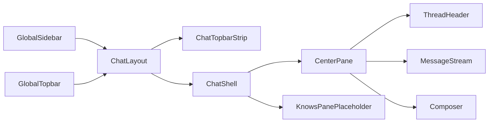
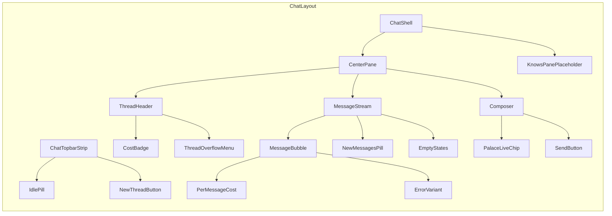

# Implementation plan: M5.2 — CEO chat dashboard surface (read-only)

**Branch**: `011-m5-2-ceo-chat-frontend` | **Date**: 2026-04-29 | **Spec**: [spec.md](./spec.md)
**Input**: [spec.md](./spec.md) (FR-200 … FR-334, SC-200 … SC-222), [m5-2-context.md](../_context/m5-2-context.md), M5.1 [spec](../010-m5-1-ceo-chat-backend/spec.md) + [plan](../010-m5-1-ceo-chat-backend/plan.md) + [retro](../../docs/retros/m5-1.md), [m5-spike](../../docs/research/m5-spike.md), [vault-threat-model](../../docs/security/vault-threat-model.md), [AGENTS.md](../../AGENTS.md), [RATIONALE.md](../../RATIONALE.md), [ARCHITECTURE.md](../../ARCHITECTURE.md), M3 retro, M4 retro, existing supervisor + dashboard codebases.

---

## Summary

M5.2 ships the dashboard surface that lets the operator drive the M5.1 chat substrate without touching SQL. A new chat route under `dashboard/app/[locale]/(app)/chat/[[...sessionId]]/` renders a three-pane layout: the existing `Sidebar` (gaining one "CEO chat" entry plus a collapsible thread-history subnav), a center pane carrying thread header + scrolling message stream + composer, and a right pane reserved as a static placeholder for M5.4's knowledge-base view. Streaming token deltas read off the M5.1 SSE route at `/api/sse/chat?session_id=…` via a new chat-specific `useChatStream` hook that instantiates the M3 5-state listener pattern; partial deltas survive mid-stream disconnect, and terminal events are read off `work.chat.message_sent` per session. Per-session and per-message cost telemetry render directly off `chat_sessions.total_cost_usd` and `chat_messages.cost_usd`; a topbar idle pill reads `chat_sessions.status` (active/ended/aborted) without a separate client clock.

Four new server actions extend `dashboard/lib/actions/chat.ts` — `createEmptyChatSession`, `endChatSession`, `archiveChatSession` + `unarchiveChatSession`, `deleteChatSession` — closing M5.1's deferred FR-082 explicit-close action and giving the operator agency over their own thread inventory. One new migration (`20260429000016_m5_2_chat_archive_and_cascade.sql`) adds `chat_sessions.is_archived BOOLEAN`, recreates the `chat_messages.session_id` FK with `ON DELETE CASCADE`, and grants `DELETE ON chat_sessions` to `garrison_dashboard_app`. The activity feed gains one new variant for `work.chat.session_deleted`.

Supervisor side, M5.2 ships a single small extension: `RunRestartSweep` in `internal/chat/listener.go` gains a second pass that detects orphan operator rows (operator message older than 60s with no assistant pair) and synthesises an aborted assistant row + flips the session to `aborted` (FR-290–292). One new sqlc query backs the detection. No new Go packages; no new Go dependencies; no new Dockerfiles.

Two test harness extensions close the M5.1 deferred SCs: T020 Playwright (`m5-2-chat-golden-path.spec.ts`) covers the six chat sub-scenarios + an axe-core a11y assertion + the SC-216 vault-leak grep; `chaos_m5_1_test.go` boots the real `garrison-mockclaude:m5` container and runs `docker kill` mid-stream. The M5.1 SC-006/SC-010/SC-011/FR-101 deferrals all close in M5.2.

The plan extends the existing dashboard. Component composition lives under `dashboard/components/features/ceo-chat/`. SSE consumer hook lives at `dashboard/lib/sse/chatStream.ts`. No frontend dependency changes are baked in; one new dev dependency (`@axe-core/playwright`) is flagged as an open question for explicit operator call before tasks land.

---

## Technical Context

**Language/Version**: TypeScript 5.6+ / Next.js 16 / React 19 (dashboard); Go 1.23 (supervisor — minimal extension only); SQL (one new migration).

**Primary Dependencies (dashboard)**: existing locked list plus **one approved dev dependency**. M5.2 adds **zero runtime dependencies**. One dev dependency lands: `@axe-core/playwright` (operator-approved per resolved Q1) — required for the FR-334 / SC-222 axe-core a11y assertion in T020 against the chat surface. Justification per AGENTS.md soft rule: stdlib has no a11y rule engine; manual screen-reader walkthrough doesn't catch CI regressions; axe-core is the de-facto WCAG-mapped engine and `@axe-core/playwright` is the official Playwright integration. ~5MB dev tree, zero runtime impact, MIT-licensed. Flagged in the implementation commit message and recapped in the M5.2 retro per AGENTS.md soft rule. The rest of the work reuses Drizzle ORM, `postgres-js` (LISTEN for the SSE route reused unchanged), better-auth, the `@tanstack/react-virtual` package already pinned at `^3.13.24` (kept available for future virtualisation; M5.2 chooses pagination per slate item 20). Tailwind v4 + the `dashboard/components/ui/` primitives from M3/M4 (`Chip`, `ConfirmDialog`, `EmptyState`, `Kbd`, `StatusDot`) cover the visual language without new abstractions.

**Primary Dependencies (supervisor)**: existing locked list. M5.2 adds **zero new dependencies**. The orphan-row sweep extension uses `pgx/v5` queries via existing `internal/store` sqlc generation, `slog` for the sweep log line, and the existing `ErrorSupervisorRestart` constant in `internal/chat/errorkind.go`. No new test imports beyond `testify` and `testcontainers-go` (both already direct since M2.3).

**Storage**: shared Postgres. One new column on `chat_sessions`. One FK reshape on `chat_messages`. One new grant (`DELETE` on `chat_sessions` for `garrison_dashboard_app`). No new tables. `chat_messages` retention follows the M5.1-set window (no trim job in M5.2). `vault_access_log` schema and grants stay frozen — FR-236 forbids `DELETE` cascade from `chat_sessions` to `vault_access_log`; rows referencing a deleted `metadata.chat_session_id` survive as forensic trail.

**Testing**:
- Vitest for the new hook, server actions, channel parser, and component-level units.
- Vitest with testcontainer Postgres for the chat server-action integration tests (matches M4 vault-action pattern).
- Playwright (`dashboard/tests/integration/`) for the T020 golden-path chat e2e — extends the existing `_harness.ts` and `_server-coverage.ts` scaffolding from M3/M4.
- Go test for the supervisor orphan-sweep extension, unit + against testcontainer Postgres.
- Go test for the chaos harness boot, real `docker kill` against `garrison-mockclaude:m5`.

**Target Platform**: Linux container for both supervisor and dashboard. Browser baseline matches M3 (`>=Chrome 130, >=Firefox 130, >=Safari 17.5`). The chat container `garrison-claude:m5` is unchanged from M5.1 — M5.2 is purely UX over the M5.1 backend, plus the orphan-sweep tweak.

**Project Type**: Web application — dashboard surface extension + supervisor sweep extension + one migration. The chat surface is the third multi-pane "feature" composition in the dashboard (after `org-overview/` and `vault/`).

**Performance Goals**:
- Operator click → first DOM-rendered SSE delta ≤ 5s wall-clock end-to-end against `garrison-mockclaude:m5` per SC-200.
- Per-session badge + per-message cost render ≤ 1s after assistant terminal commit (SC-206/207).
- Topbar idle pill flip ≤ one page render cycle after supervisor sweep flips `status` (SC-208) — no client-side timer.
- Long-running thread (≥100 turns) initial-load TTI ≤ 2s on developer-grade laptop (SC-221) — pagination keeps the initial DOM bounded to 50 turns.

**Constraints**:
- AGENTS.md concurrency rules 1, 2, 6 bind on the supervisor sweep extension (every goroutine has a context; root-ctx-cancellation cascades; terminal writes via `context.WithoutCancel(ctx)` + `TerminalWriteGrace`).
- Dashboard server actions pass through the M3+ better-auth gate; ownership checks before any `chat_sessions` write per FR-241 / FR-234 / FR-236.
- Threat-model rule 6 carries to chat audit: `pg_notify('work.chat.session_deleted', …)` payload carries `chat_session_id` + `actor_user_id` only — never message content (FR-321).
- WCAG 2.1 AA target on the chat surface (FR-330–334). No serious or critical axe-core violations on the chat route in golden-path render (SC-222).

**Scale/Scope**: single operator, single concurrent chat session per Constitution X (carryover from M5.1). The thread-history subnav caps at 10 default + a "view all" link so even an active operator with 1000 threads doesn't bloat the sidebar.

---

## Constitution Check

Garrison constitution (`.specify/memory/constitution.md`) gates:

- **Principle I (Postgres + pg_notify)**: M5.2 honors it. New `pg_notify` channel: `work.chat.session_deleted` (operator delete only). Existing M5.1 chat channels (`work.chat.session_started`, `work.chat.message_sent`, `work.chat.session_ended`) are reused without semantic change. No HTTP-only side channels; no in-memory state shared between supervisor and dashboard.
- **Principle II (MemPalace as memory layer)**: chat continues to read MemPalace via the chat container's `mempalace` MCP server. M5.2 changes nothing here — the palace-live chip's data source is the existing `chat_messages.raw_event_envelope`, not a new MemPalace API.
- **Principle III (ephemeral agents)**: chat container lifecycle is unchanged from M5.1 (one container per turn, `--rm`). M5.2 is purely UX over the existing ephemeral pattern.
- **Principle IV (soft gates)**: M5.2 introduces zero hard gates on the chat itself. The "End thread" action is operator-driven and reversible only by starting a new thread; the "Delete thread" action is gated by `ConfirmDialog tier='single-click'` (FR-237) — same lightweight tier the M4 vault `revealSecret` action uses.
- **Principle V (skills.sh)**: not applicable — chat doesn't load skills.
- **Principle VI (UI-driven hiring)**: not applicable — chat does not create agents in M5.2 (M5.3+).
- **Principle VII (Go-only supervisor with locked deps)**: M5.2 adds **zero** Go dependencies. The supervisor extension is one function in `internal/chat/listener.go` plus one sqlc query. The dashboard side is TypeScript-only. The principle is preserved.
- **Principle VIII (every goroutine has a context)**: the orphan-sweep extension runs inside the existing `RunRestartSweep` goroutine which already accepts the supervisor's root context. No new goroutines.
- **Principle IX (narrow specs per milestone)**: M5.2 stays inside the FR-200 → FR-334 envelope. Out-of-scope per spec/context: chat-driven mutations (M5.3), knowledge-base pane (M5.4), tool-call inline chips (v1.1), warm-pool optimization (post-M5), hiring (M7).
- **Principle X (per-department concurrency caps)**: not applicable — chat is a global single-resource per Constitution X. The sidebar's `live` widget continues to read agent capacity, not chat capacity.
- **Principle XI (self-hosted)**: M5.2 introduces no cloud dependencies. The new dashboard surface is self-hosted Next.js; the supervisor extension is in-binary. The Anthropic API dependency is the existing M5.1 cost.

**Concurrency discipline §AGENTS.md "non-negotiable" rules**:

- **Rule 1** (every goroutine has a context): the orphan-sweep extension runs inside `RunRestartSweep`, which already takes `ctx context.Context`. The new INSERT loop iterates synchronously inside that ctx. No new goroutines.
- **Rule 2** (root context owns SIGTERM cascade): supervisor SIGTERM cancels root ctx; the sweep is one-shot at boot, completes or aborts under root cancellation. No additional cascade work.
- **Rule 6** (terminal write via WithoutCancel): the synthetic-assistant terminal write inside the sweep uses `context.WithoutCancel(ctx)` + `TerminalWriteGrace` matching the M5.1 pattern in `policy.go`. Rationale: if the supervisor receives SIGTERM mid-sweep, the in-progress synthetic terminal write should still commit; a partial cleanup is worse than no cleanup.

**Scope discipline (AGENTS.md §)**: M5.2 stays read-side over chat content; the only new mutations are operator-driven session housekeeping (end/archive/delete), all within the chat domain. M5.2 does not touch ticket / agent / vault / org-overview surfaces, does not introduce a `garrison-mutate` MCP server, does not amend the threat model. Mutations of chat content (assistant-driven) remain M5.3 territory behind the threat-model amendment that milestone takes on.

**Constitutional violations to track**: one approved dev dependency (`@axe-core/playwright`) lands as a dev-only test dependency for FR-334 / SC-222 conformance. Justified per AGENTS.md soft rule: no stdlib alternative for a Playwright-integrated WCAG rule engine; manual screen-reader review is unsuitable as a CI regression guard. Will be recapped in the M5.2 retro alongside any other locked-deps deltas.

---

## Project Structure

### Documentation (this feature)

```text
specs/011-m5-2-ceo-chat-frontend/
├── spec.md                # /speckit.specify + /speckit.clarify output
├── plan.md                # this file
├── tasks.md               # /speckit.tasks output (NOT created by /speckit.plan)
└── acceptance-evidence.md # post-implementation (matches M3 + M4 + M5.1 pattern)
```

The context lives outside the milestone dir per Garrison convention:

```text
specs/_context/m5-2-context.md
```

### Source code (repository root)

```text
dashboard/
├── app/[locale]/(app)/
│   └── chat/                                  ← NEW
│       ├── layout.tsx                         ← three-pane shell (chat-only topbar + ChatShell)
│       ├── page.tsx                           ← /chat (no-thread-selected)
│       ├── [[...sessionId]]/page.tsx          ← /chat/<uuid> (session view)
│       └── all/page.tsx                       ← /chat/all (full thread list)
├── components/features/ceo-chat/              ← NEW package
│   ├── ChatShell.tsx                          ← three-pane composition
│   ├── ChatTopbarStrip.tsx                    ← idle pill + new-thread CTA
│   ├── ThreadHeader.tsx                       ← title + cost badge + overflow menu
│   ├── ThreadOverflowMenu.tsx                 ← end / archive / unarchive / delete
│   ├── MessageStream.tsx                      ← scroll container + sticky-bottom logic
│   ├── MessageBubble.tsx                      ← operator/assistant variants + cost footer
│   ├── Composer.tsx                           ← textarea + send + state machine
│   ├── PalaceLiveChip.tsx                     ← live/stale/unavailable
│   ├── IdlePill.tsx                           ← active/idle/aborted
│   ├── ThreadHistorySubnav.tsx                ← left-rail collapsible (client component)
│   ├── KnowsPanePlaceholder.tsx               ← right-pane M5.4 stub
│   ├── EmptyStates.tsx                        ← (a) no-threads / (b) empty-thread / (c) ended
│   ├── errorMessages.ts                       ← ChatErrorKind → display copy table
│   └── format.ts                              ← cost / time-ago / thread-number helpers
├── components/layout/Sidebar.tsx              ← MODIFIED (add CEO chat entry + subnav slot)
├── lib/actions/chat.ts                        ← MODIFIED (add 5 new actions; Open Question O3)
├── lib/queries/chat.ts                        ← MODIFIED (extend listSessionsForUser, add helpers)
├── lib/sse/chatStream.ts                      ← NEW (useChatStream hook)
├── lib/sse/channels.ts                        ← MODIFIED (add work.chat.session_deleted literal)
├── lib/sse/events.ts                          ← MODIFIED (add chat.session_deleted variant)
├── components/features/activity-feed/EventRow.tsx  ← MODIFIED (render new variant)
├── tests/integration/m5-2-chat-golden-path.spec.ts ← NEW (T020)
├── tests/integration/responsive.spec.ts       ← MODIFIED (add chat surface block)
└── drizzle/schema.supervisor.ts               ← REGENERATED via bun run drizzle:pull

migrations/
├── 20260429000016_m5_2_chat_archive_and_cascade.sql ← NEW
└── queries/chat.sql                                   ← MODIFIED (add FindOrphanedOperatorSessions + InsertSyntheticAssistantAborted)

supervisor/
├── internal/chat/listener.go                  ← MODIFIED (extend RunRestartSweep)
├── internal/chat/listener_test.go             ← MODIFIED (add orphan-sweep test)
├── internal/chat/chaos_m5_1_test.go           ← NEW
└── internal/store/chat.sql.go                 ← REGENERATED via sqlc

ARCHITECTURE.md                                 ← MODIFIED (line 574 amendment)
docs/ops-checklist.md                           ← MODIFIED (M5.2 section)
```

**Structure decision**: dashboard work concentrates inside a single new feature folder (`components/features/ceo-chat/`) plus a single new SSE consumer hook file. The chat layout adds itself under `(app)/` so the existing global sidebar/topbar shell continues to wrap it, and the chat-specific topbar strip composes inside the chat layout (slate item 6, Open Question O2). Supervisor changes are deliberately small — one function extension and one new test file. Migration shape is one new SQL file plus a sqlc query addition.

---

## Phase 0 — Research

The spec resolved every open question the context file flagged; the spike (`docs/research/m5-spike.md`) plus the M5.1 retro removed every binding-input ambiguity for backend behavior. The plan does not re-research and produces no `research.md` artifact for the spec-kit phase 0 slot.

Two technique-level research notes worth flagging here so they land in the plan rather than the implementation log:

### R0 — Dropping the chat FK + recreating with cascade

Per slate item 29 the migration drops `chat_messages_session_id_fkey` and recreates it with `ON DELETE CASCADE`. Postgres semantics: dropping and recreating a FK is online for typical row counts (the plan assumes < 100K `chat_messages` rows in any deployed Garrison instance, well under the threshold where the recreate would be visibly slow). The recreate runs inside the goose `+goose Up` block so it's atomic against application traffic via the migration's wrapping transaction. Since `garrison_dashboard_app` would otherwise be able to INSERT `chat_messages` rows that reference the no-longer-existing-during-recreate constraint, the migration runs in a single transaction that briefly takes an `ACCESS EXCLUSIVE` lock on `chat_messages` — this is the same lock posture goose's default mode uses for any `ALTER TABLE`.

### R1 — useChatStream vs M3 listener: separate instances

The M3 listener at `dashboard/lib/sse/listener.ts` is a singleton designed for the activity feed: one connection, multiple subscribers, channel allowlist matched against `KNOWN_CHANNELS`. The chat use case is one per-session `EventSource` opened by the `/api/sse/chat?session_id=…` route — multiple sessions, server-keyed routing — and the dashboard is the SSE *client* (browser `EventSource`) not the *producer*. The same 5-state machine pattern applies (`dormant/connecting/live/backoff/idle-grace`) but the implementation lives in a separate file because the listener's allowlist + poll-fallback machinery doesn't apply to chat. Per slate item 2 this is a chat-specific instance, not a parameterised fork. The result is two ~150-line implementations using the same state names; that duplication is acceptable per the M3 retro's "separate machine, same vocabulary" precedent and avoids the `lib/sse/listener.ts` becoming a Christmas tree of options.

---

## Phase 1 — Design

### 1.1 Three-pane layout + routing

The chat route lives under `dashboard/app/[locale]/(app)/chat/`:

```
/chat                       → page.tsx (no-thread-selected state — empty if no threads, otherwise routes-to-most-recent)
/chat/<uuid>                → [[...sessionId]]/page.tsx (active session view)
/chat/all                   → all/page.tsx (full thread list, active + archived sub-tabs)
```

The `(app)/layout.tsx` shell continues to wrap chat — sidebar + global topbar stay unchanged. The chat layout (`/chat/layout.tsx`) renders **inside** that shell:



`ChatShell.tsx` is a flex three-column layout (center pane fluid, right pane `w-[360px]` on `≥1024px`, collapsed under that breakpoint per FR-202). `ChatTopbarStrip.tsx` is a strip rendered above `ChatShell` carrying the idle pill (left), thread breadcrumb (center), and "+ New thread" button (right). The strip is chat-only — global Topbar is not modified per slate item 6 / Open Question O2.

The right-pane `KnowsPanePlaceholder.tsx` renders an `EmptyState` with copy:

> **What the CEO knows**
> Knowledge-base context lands in M5.4. For now this pane is reserved.

### 1.2 Sidebar extension

`dashboard/components/layout/Sidebar.tsx` gains one new `NavLink` entry between `Activity` and `Hygiene`:

```tsx
<NavLink href="/chat" label="CEO chat" icon={<ChatIcon />} />
```

Plus a new `<ThreadHistorySubnav />` rendered immediately under that link as a client-side collapsible panel. The subnav fetches via a new `getRecentThreadsForCurrentUser()` server action returning the latest 10 active threads (`is_archived=false` ordered `started_at DESC`) plus a "view all" link to `/chat/all`. The subnav uses `<details>`/`<summary>` for native expand/collapse, falling back to keyboard-accessible buttons.

A new icon `ChatIcon` joins `dashboard/components/ui/icons.tsx` (thin-line speech-bubble, matching the existing M3 stroke style).

### 1.3 Public interfaces — server actions

All five new actions live in `dashboard/lib/actions/chat.ts` alongside the M5.1 `startChatSession` + `sendChatMessage`. Existing exports unchanged.

```ts
// New action 1 — creates an empty session for "+ New thread"
export async function createEmptyChatSession(): Promise<{ sessionId: string }>;

// New action 2 — operator-driven session close (FR-082 follow-through)
export async function endChatSession(sessionId: string): Promise<{ session: ChatSessionRow }>;

// New action 3 — archive flip
export async function archiveChatSession(sessionId: string): Promise<void>;

// New action 4 — un-archive flip
export async function unarchiveChatSession(sessionId: string): Promise<void>;

// New action 5 — hard delete (cascades chat_messages)
export async function deleteChatSession(sessionId: string): Promise<void>;
```

Plus one new server-side helper used by the sidebar subnav:

```ts
// New helper — used by ThreadHistorySubnav (server-rendered initial state)
export async function getRecentThreadsForCurrentUser(
  limit?: number,
): Promise<ChatSessionRow[]>;
```

Internal helper introduced in the same module:

```ts
// Caller-ownership gate. Throws ChatError(SessionNotFound) on miss
// or non-owner — distinction NOT exposed externally to avoid an
// enumeration vector. Reused by all four mutating actions.
async function requireSessionOwner(
  sessionId: string,
): Promise<{ userId: string; session: ChatSessionRow }>;
```

#### Action shapes — invariants

- **`createEmptyChatSession`**: opens a tx; INSERTs into `chat_sessions` with `started_by_user_id = currentUserId, status='active'`; commits; returns `{ sessionId }`. **No `pg_notify`**. **No first message**. Per FR-061 carryover from M5.1: empty sessions cost nothing because no spawn happens; the cost-cap is reactive at next-spawn time. Per spec edge case "Operator clicks '+ New thread' rapidly multiple times" — N empty rows land, no spawn, no cost.
- **`endChatSession`**: ownership gate; tx with `UPDATE chat_sessions SET status='ended', ended_at=NOW() WHERE id=$1 AND status='active'` + `SELECT pg_notify('work.chat.session_ended', json_build_object('chat_session_id', $1, 'status', 'ended')::text)`. If `status` was already `ended` or `aborted`, the UPDATE is a no-op (zero rows affected); the action returns the current row state without notifying. Per FR-244 carryover: invocation while an in-flight assistant message exists ACCEPTS — the supervisor doesn't observe the dashboard transition; the in-flight turn finishes its terminal write naturally; subsequent operator INSERTs on the now-ended session bounce with `error_kind='session_ended'` per M5.1 FR-081.
- **`archiveChatSession` / `unarchiveChatSession`**: ownership gate; `UPDATE chat_sessions SET is_archived = $bool WHERE id=$1`. **No `pg_notify`** per FR-234 — archive is a display flag, not an activity-feed-worthy event.
- **`deleteChatSession`**: ownership gate; tx with `DELETE FROM chat_sessions WHERE id=$1` (FK cascade removes `chat_messages` rows) + `SELECT pg_notify('work.chat.session_deleted', json_build_object('chat_session_id', $1, 'actor_user_id', $userId)::text)`. Per FR-321: payload carries IDs only — no message content. Per FR-236: `vault_access_log` rows referencing the deleted session via `metadata.chat_session_id` survive — the FK is JSON-deep, not a Postgres FK, so cascade does not reach there. The dashboard role retains its M4 INSERT-only grant on `vault_access_log` (no DELETE grant added).

#### `ChatErrorKind` extension

The existing M5.1 enum at `dashboard/lib/actions/chat.ts:35-42` carries `EmptyContent | ContentTooLarge | SessionEnded | SessionNotFound | TurnIndexCollision`. M5.2 adds **zero** new kinds. The four new mutating actions throw existing kinds:

- Non-existent or non-owned session → `ChatError(SessionNotFound)` (collapses ownership distinction per slate item 11).
- `endChatSession` against `aborted` session → `ChatError(SessionEnded)` (treat aborted as already-closed; the operator's intent of "close it" is satisfied).
- `archive` / `unarchive` / `delete` are idempotent against any session state; no new error kinds needed.

### 1.4 Public interfaces — queries

`dashboard/lib/queries/chat.ts` extends the M5.1 surface:

```ts
// Existing — kept unchanged
export async function listSessionsForUser(userId: string, limit = 50): Promise<ChatSessionRow[]>;

// MODIFIED — adds optional archived filter (default false)
export async function listSessionsForUser(
  userId: string,
  options?: { archived?: boolean; limit?: number },
): Promise<ChatSessionRow[]>;

// Existing — kept unchanged
export async function getSessionWithMessages(sessionId: string): Promise<{ session: ChatSessionRow; messages: ChatMessageRow[] } | null>;

// Existing — kept unchanged
export async function getRunningCost(sessionId: string): Promise<number>;

// NEW — palace-live chip data source
export async function getMostRecentMempalaceCallAge(
  sessionId: string,
): Promise<{ ageMs: number | null }>;
```

`getMostRecentMempalaceCallAge` reads the most recent `chat_messages.raw_event_envelope` JSONB for the session and parses for `tool_use`/`tool_result` pairs targeting `mcp_server: 'mempalace'` with `is_error: false`. Returns `{ ageMs: null }` if no successful MemPalace call has happened in the session yet. Implementation runs as a single `SELECT raw_event_envelope, terminated_at FROM chat_messages WHERE session_id=$1 AND role='assistant' ORDER BY turn_index DESC LIMIT 5` then parses client-side — keeping the JSONB parse in TypeScript avoids embedding parse logic in SQL, matches M3's pattern of "Drizzle returns rows; TypeScript transforms."

The `listSessionsForUser` extension is backward-compatible: callers passing nothing get `archived=false, limit=50`. The single existing M5.1 call site is unchanged.

`getRecentThreadsForCurrentUser(limit=10)` lives in `lib/actions/chat.ts` rather than `lib/queries/chat.ts` because it reads `getSession()` to derive `userId` — actions can call queries, but queries are pure-data helpers per M3 convention. The action is a thin wrapper that calls `listSessionsForUser(currentUserId, { archived: false, limit })`.

### 1.5 Public interfaces — SSE consumer hook

`dashboard/lib/sse/chatStream.ts` exports a single hook:

```ts
export interface UseChatStreamResult {
  state: 'dormant' | 'connecting' | 'live' | 'backoff' | 'idle-grace';
  /** Map of in-flight messageId → accumulated buffer (string). Stable
   *  reference per messageId; React-friendly. */
  partialDeltas: Map<string, string>;
  /** Map of messageId → terminal event payload. Set on `terminal`
   *  arrival; never cleared client-side. */
  terminals: Map<string, ChatTerminalEvent>;
  /** True after `session_ended` event arrives. */
  sessionEnded: boolean;
  /** Last error from EventSource (e.g. 'connection_lost'); null when live. */
  lastError: string | null;
}

export function useChatStream(sessionId: string): UseChatStreamResult;
```

#### Lifecycle

```mermaid
stateDiagram-v2
    [*] --> dormant: initial mount
    dormant --> connecting: subscribe()
    connecting --> live: open event
    connecting --> backoff: error event
    live --> backoff: error event (mid-stream)
    backoff --> connecting: backoff timer fires (100ms→30s exp)
    live --> idle-grace: hook unmount with timer
    idle-grace --> dormant: 60s elapsed
    idle-grace --> live: re-subscribe within 60s
    dormant --> [*]: cleanup
```

The hook opens a `new EventSource('/api/sse/chat?session_id=' + sessionId)` on first mount, listens for three event types:

1. `delta` — `{ messageId, seq, delta_text }`. Append to `partialDeltas[messageId]`. Dedupe on `(messageId, seq)` via an internal `Set<string>` of seen seq keys (slate item 14). On reconnect mid-stream, deduped seqs are dropped silently — no double-render.
2. `terminal` — `{ messageId, status, content, errorKind, costUsd }`. Set `terminals[messageId]`. Do **not** clear `partialDeltas[messageId]` — the renderer prefers `terminals[messageId]?.content` if present, else falls back to `partialDeltas[messageId]`.
3. `session_ended` — set `sessionEnded=true`. Close the EventSource cleanly.

On `error`, transition to `backoff`; schedule a retry per the exponential schedule (100ms → 200ms → 400ms → … → 30s cap). Per FR-262: partial deltas already accumulated are NOT cleared on reconnect.

On `sessionId` prop change (operator switches threads): close the current EventSource cleanly (FR-263), reset all maps, open a new EventSource for the new session_id (FR-232).

On hook unmount: enter `idle-grace` for 60s; if re-subscribed within window, skip the reconnect; else close. Same `idle-grace` semantics as the M3 listener — cheap optimization for tab-switch + back navigation.

#### Hook return-shape stability

Per Open Question O5 (operator approved as default): `partialDeltas` exposes the accumulated buffer as a single string per `messageId` — concat performed inside the hook. Memory cost is one extra string per active stream (in the worst case ~10KB per turn × 1 active turn at a time, negligible). The renderer reads `partialDeltas.get(messageId) ?? ''` directly, no further work.

### 1.6 Composer state machine

`Composer.tsx` is a client component. Its internal state:

```ts
type ComposerState =
  | { kind: 'idle' }
  | { kind: 'typing'; draft: string }
  | { kind: 'submitting'; draft: string }
  | { kind: 'streaming' }              // in-flight turn; composer disabled
  | { kind: 'disabled-ended' }         // chat_sessions.status='ended'
  | { kind: 'disabled-cost-cap' };     // most recent error_kind='session_cost_cap_reached'
```

Note: `aborted` is NOT a disabled state — per FR-215 + spec clarify, the composer stays enabled when `chat_sessions.status='aborted'` so the operator's next turn proceeds as a new message in the same session per M5.1 SC-009.

Transitions:

```mermaid
stateDiagram-v2
    [*] --> idle
    idle --> typing: keystroke
    typing --> idle: clear / blur
    typing --> submitting: ⌘↵ or send click
    submitting --> streaming: server action returns; SSE first delta begins
    streaming --> idle: terminal event arrives
    idle --> disabled_ended: chat_sessions.status flips to ended
    streaming --> disabled_ended: ditto (in-flight turn finishes naturally per FR-244)
    [*] --> disabled_cost_cap: latest error_kind = session_cost_cap_reached
    disabled_ended --> [*]: thread changes
    disabled_cost_cap --> [*]: thread changes (operator opens new thread)
```



The "disabled" derivations are computed at render time from props (`session.status`, `latestMessage.errorKind`) — not stored in `useState`. Local state holds only `{ draft, isSubmitting }`; everything else is derived.

#### Submit binding

`onKeyDown` on the textarea checks `(event.metaKey || event.ctrlKey) && event.key === 'Enter'` → `event.preventDefault()` + submit. Plain `Enter` inserts a newline (default textarea behavior, no preventDefault). Submit also fires on the send button click. Empty / whitespace-only drafts disable the send button (FR-281).

#### Max input length

10240 bytes, UTF-8 byte count. Enforced on `onPaste` and `onChange`. On paste exceeding the limit, truncate the pasted content to fit and surface a non-blocking warning toast: *"Pasted content was truncated to 10KB. Send what you have or break it up across messages."*

#### Auto-focus

On session-open: `useEffect(focusOnMount)`. After each terminal commit (visible via `terminals` map): `useEffect` keyed on terminal arrival re-focuses the textarea. Mirrors the FR-218 expectation.

### 1.7 Streaming UX — append-as-arrived + sticky-bottom + cursor

`MessageStream.tsx` is a client component scrolling container. Per slate item 18 it appends deltas as they arrive — no typewriter, no per-character animation.

#### Sticky-bottom logic

Custom hook `useStickyBottom(ref)`:

```ts
function useStickyBottom(ref: RefObject<HTMLElement>) {
  const [isStuck, setIsStuck] = useState(true);
  const onScroll = () => {
    const el = ref.current;
    if (!el) return;
    const distanceFromBottom = el.scrollHeight - el.scrollTop - el.clientHeight;
    setIsStuck(distanceFromBottom < 40); // hysteresis
  };
  // Wire onScroll to ref, scroll-into-view-on-new-content when isStuck.
  return { isStuck, scrollToBottom };
}
```

When `isStuck`, the stream auto-scrolls on every delta append (via `el.scrollTo({ top: el.scrollHeight })` from a layout effect keyed on the latest delta). When `!isStuck`, auto-scroll disables and a "↓ N new" pill appears anchored to the bottom-right of the stream container; clicking the pill calls `scrollToBottom` and re-engages stickiness. N counts terminal commits since the operator scrolled up — recomputed from `terminals.size` minus the last-seen-count snapshot.

#### Cursor

The in-flight assistant bubble renders a trailing cursor `▍` styled via Tailwind:

```css
@keyframes garrison-cursor-blink {
  0%, 50% { opacity: 1; }
  51%, 100% { opacity: 0; }
}
.cursor { animation: garrison-cursor-blink 1.06s infinite; }
@media (prefers-reduced-motion: reduce) {
  .cursor { animation: none; opacity: 1; }
}
```

The cursor is rendered as a `<span aria-hidden="true">▍</span>` so screen readers don't announce it (the streaming text itself is announced via `aria-live` per FR-331).

### 1.8 Long-thread strategy

Per slate item 20: pagination, not virtualisation. `getSessionWithMessages` extends to:

```ts
export async function getSessionWithMessages(
  sessionId: string,
  options?: { limit?: number; beforeTurnIndex?: number },
): Promise<{ session: ChatSessionRow; messages: ChatMessageRow[]; hasMore: boolean } | null>;
```

Default behavior: returns the most recent 50 messages by `turn_index DESC`, then reverse-sorted to `turn_index ASC` for render. `hasMore` is true if `count(*) > 50`. The client renders a "Load earlier" button at the top of the message stream that re-fetches with `beforeTurnIndex = oldest currently rendered turn_index`. Each "load earlier" call appends 50 more turns to the top of the stream.

Forward-compatibility: the function signature accepts `limit` so a future M5.4 polish round could swap in `@tanstack/react-virtual` against the same query without changing the call site.

### 1.9 Idle pill + cost telemetry

`IdlePill.tsx` (client component, renders inside `ChatTopbarStrip`):

```tsx
export function IdlePill({ status }: { status: 'active' | 'ended' | 'aborted' }) {
  const tone = status === 'active' ? 'ok' : status === 'ended' ? 'warn' : 'err';
  const label = status === 'active' ? 'active' : status === 'ended' ? 'idle' : 'aborted';
  return (
    <div className="flex items-center gap-1.5">
      <StatusDot tone={tone} pulse={status === 'active'} />
      <span className="text-text-1 text-[11px] font-medium">{label}</span>
    </div>
  );
}
```

Per FR-332 the pill combines color (StatusDot tone) with a text label — colorblind-safe.

The `status` prop is passed through from the chat layout's server-fetched session row. On terminal-event arrival via `useChatStream`, the layout re-fetches the session row (cheap — single-row by-id) so the status reflects the latest supervisor write. The pill's flip is driven by `chat_sessions.status` directly per FR-250 — no client-side timer.

`ThreadHeader.tsx` cost badge:

```tsx
function CostBadge({ totalCostUsd }: { totalCostUsd: number }) {
  const formatted = new Intl.NumberFormat('en-US', {
    style: 'currency',
    currency: 'USD',
    minimumFractionDigits: 2,
    maximumFractionDigits: 2,
  }).format(totalCostUsd);
  return (
    <span className="font-mono font-tabular text-text-2 text-[12px]">
      {formatted}
    </span>
  );
}
```

`MessageBubble.tsx` per-message cost footer (assistant only):

```tsx
function PerMessageCost({ costUsd }: { costUsd: number | null }) {
  if (costUsd === null) return null;
  const formatted = new Intl.NumberFormat('en-US', {
    style: 'currency',
    currency: 'USD',
    minimumFractionDigits: 4,
    maximumFractionDigits: 4,
  }).format(costUsd);
  return (
    <span className="font-mono font-tabular text-text-3 text-[10px]">
      {formatted}
    </span>
  );
}
```

Operator bubbles render no cost footer (cost is `NULL` per M5.1 schema).

### 1.10 Palace-live chip

`PalaceLiveChip.tsx` (client component, renders inside Composer footer):

```tsx
type PalaceLiveTone = 'live' | 'stale' | 'unavailable';

export function PalaceLiveChip({ ageMs }: { ageMs: number | null }) {
  let tone: PalaceLiveTone;
  if (ageMs === null) tone = 'unavailable';
  else if (ageMs <= 5 * 60_000) tone = 'live';
  else if (ageMs <= 30 * 60_000) tone = 'stale';
  else tone = 'unavailable';

  // FR-332: color + icon, never color alone
  const dot = tone === 'live' ? 'ok' : tone === 'stale' ? 'warn' : 'err';
  const label = tone === 'live' ? 'palace live' : tone === 'stale' ? 'palace stale' : 'palace unavailable';
  return (
    <Chip>
      <StatusDot tone={dot} />
      <span>{label}</span>
    </Chip>
  );
}
```

The `ageMs` value is read by the chat layout from `getMostRecentMempalaceCallAge(sessionId)` and passed in as a prop. Refetched on every terminal commit (i.e., when `useChatStream`'s `terminals` map changes size). Thresholds per FR-283: ≤5 min live; 5-30 min stale; >30 min OR never unavailable.

### 1.11 Thread title

Per slate item 27: numbered titles only. The thread label is computed at query time:

```sql
-- The N in "thread #N" is the operator's per-user index.
SELECT
  cs.*,
  ROW_NUMBER() OVER (
    PARTITION BY started_by_user_id
    ORDER BY started_at ASC
  ) AS thread_number
FROM chat_sessions cs
WHERE started_by_user_id = $1
ORDER BY started_at DESC;
```

The number is computed inside `listSessionsForUser` (extended) and `getSessionWithMessages` (extended to attach `threadNumber` via a follow-on lookup).

Trade-off: `thread_number` is recomputed on every read — not stored. Acceptable because (a) per-operator session count is bounded (≤ thousands lifetime), (b) the index lookup is a single-table sort already covered by `idx_chat_sessions_user_started`, (c) avoiding a stored column means no migration or trigger to maintain when threads are deleted (deleting thread #5 of 10 leaves the post-delete numbering as 1,2,3,4,5,6,7,8,9 — possibly unexpected for the operator, but consistent with "numbering reflects current threads"). If renumber-on-delete becomes confusing in operator week-of-use, M5.4 polish round can add a stored `thread_number` column.

### 1.12 Schema migration

`migrations/20260429000016_m5_2_chat_archive_and_cascade.sql`:

```sql
-- M5.2 — chat dashboard surface (read-only).
--
-- Three changes to the M5.1 chat schema:
--
--   1. chat_sessions.is_archived BOOLEAN NOT NULL DEFAULT false
--      — operator-driven archive flag for thread housekeeping.
--      Backfills existing rows to false. Does NOT extend the
--      M5.1 status enum (FR-233).
--
--   2. chat_messages.session_id FK recreated with ON DELETE CASCADE
--      — operator-driven thread deletion (deleteChatSession server
--      action) cascades the transcript. Original M5.1 FK had no
--      cascade clause; recreate is online for typical row counts
--      and runs inside the migration's wrapping transaction.
--
--   3. GRANT DELETE ON chat_sessions TO garrison_dashboard_app
--      — required for the deleteChatSession server action. No
--      grant on chat_messages — the cascade does the work, and
--      keeping chat_messages INSERT/SELECT-only on the dashboard
--      role mirrors M4's "narrow grants" stance.
--
-- vault_access_log is intentionally NOT touched (FR-236):
--   - rows referencing a deleted chat_session_id via JSONB
--     metadata survive as forensic trail
--   - garrison_dashboard_app keeps M4's INSERT-only grant on
--     vault_access_log; no DELETE grant added

-- +goose Up

ALTER TABLE chat_sessions
  ADD COLUMN is_archived BOOLEAN NOT NULL DEFAULT false;

CREATE INDEX idx_chat_sessions_user_active_unarchived
  ON chat_sessions (started_by_user_id, started_at DESC)
  WHERE is_archived = false;

ALTER TABLE chat_messages
  DROP CONSTRAINT chat_messages_session_id_fkey;
ALTER TABLE chat_messages
  ADD CONSTRAINT chat_messages_session_id_fkey
  FOREIGN KEY (session_id) REFERENCES chat_sessions(id) ON DELETE CASCADE;

GRANT DELETE ON chat_sessions TO garrison_dashboard_app;

-- +goose Down

REVOKE DELETE ON chat_sessions FROM garrison_dashboard_app;

ALTER TABLE chat_messages
  DROP CONSTRAINT chat_messages_session_id_fkey;
ALTER TABLE chat_messages
  ADD CONSTRAINT chat_messages_session_id_fkey
  FOREIGN KEY (session_id) REFERENCES chat_sessions(id);

DROP INDEX idx_chat_sessions_user_active_unarchived;

ALTER TABLE chat_sessions DROP COLUMN is_archived;
```

After `goose up`:
- `bun run drizzle:pull` regenerates `dashboard/drizzle/schema.supervisor.ts` to add the `isArchived: boolean` field on `chatSessions`. No manual edits required.
- `bun run typecheck` passes (SC-219).

### 1.13 Activity feed integration

#### `dashboard/lib/sse/channels.ts`

Add one literal to `KNOWN_CHANNELS`:

```diff
 export const KNOWN_CHANNELS = [
   'work.ticket.created',
   'work.ticket.edited',
   'work.agent.edited',
+  'work.chat.session_deleted',
 ] as const;
```

Add one branch to `parseChannel`:

```ts
if (row.channel === 'work.chat.session_deleted') {
  return {
    kind: 'chat.session_deleted',
    eventId: row.id,
    at,
    chatSessionId: pickString(payload.chat_session_id, payload.chatSessionId),
    actorUserId: pickString(payload.actor_user_id, payload.actorUserId),
  };
}
```

#### `dashboard/lib/sse/events.ts`

Add one variant to `ActivityEvent`:

```ts
| {
    kind: 'chat.session_deleted';
    eventId: string;
    at: string;
    chatSessionId: string;
    actorUserId: string;
  }
```

#### `dashboard/components/features/activity-feed/EventRow.tsx`

Add one rendering branch — chat-flavoured row matching the M5.1 audit-event style; uses a chat-specific icon plus the literal copy *"Chat thread <chatSessionId-short> deleted by operator"*. The actor's display name is not derived in M5.2 (single-operator system per M5 scope); if multi-operator lands post-M5, this row's render gets the actor lookup added.

#### Why a literal channel, not a pattern

Per FR-264 carryover from M3 FR-060: literal channels go into `KNOWN_CHANNELS`, parameterised channels go into `KNOWN_CHANNEL_PATTERNS`. `work.chat.session_deleted` is literal — no per-operator or per-session segmentation in the channel name; the payload carries those.

### 1.14 Supervisor-side orphan-row sweep extension

#### Sweep semantics

Per FR-290: detect `chat_sessions.status='active'` rows where the newest `chat_messages` row has `role='operator'` AND `created_at < NOW() - INTERVAL '60 seconds'` AND no assistant pair exists (no `chat_messages` row with `session_id = $1` AND `turn_index = $newest_operator.turn_index + 1`).

For each match, INSERT a synthetic assistant row:

```sql
INSERT INTO chat_messages (
  session_id,
  turn_index,
  role,
  status,
  content,
  error_kind,
  terminated_at
) VALUES (
  $session_id,
  $orphan_turn_index + 1,
  'assistant',
  'aborted',
  '[supervisor restarted before this turn could complete]',
  'supervisor_restart',
  NOW()
);
```

Then UPDATE `chat_sessions.status='aborted'` for that session.

#### Implementation site

`supervisor/internal/chat/listener.go` — `RunRestartSweep` extends. Pseudocode:

```go
func RunRestartSweep(ctx context.Context, deps Deps) error {
    // Existing M5.1 pass: mark pending/streaming chat_messages as aborted (unchanged).
    if err := markPendingAborted(ctx, deps); err != nil {
        return err
    }

    // NEW M5.2 pass: detect orphan operator rows + synthesise terminal.
    orphans, err := deps.Queries.FindOrphanedOperatorSessions(ctx, sixtySecondCutoff)
    if err != nil {
        return fmt.Errorf("chat: find orphans: %w", err)
    }
    for _, o := range orphans {
        // Terminal write under WithoutCancel + grace per concurrency rule 6.
        twCtx, cancel := context.WithTimeout(
            context.WithoutCancel(ctx),
            deps.TerminalWriteGrace,
        )
        defer cancel()
        tx, err := deps.Pool.Begin(twCtx)
        if err != nil {
            deps.Logger.Warn("chat: orphan sweep tx", "err", err)
            continue
        }
        if err := deps.Queries.WithTx(tx).InsertSyntheticAssistantAborted(twCtx, ...); err != nil {
            _ = tx.Rollback(twCtx)
            deps.Logger.Warn("chat: orphan sweep insert", "err", err)
            continue
        }
        if err := deps.Queries.WithTx(tx).MarkSessionAborted(twCtx, o.SessionID); err != nil {
            _ = tx.Rollback(twCtx)
            continue
        }
        if err := tx.Commit(twCtx); err != nil {
            deps.Logger.Warn("chat: orphan sweep commit", "err", err)
            continue
        }
        deps.Logger.Info("chat: orphan sweep synthesised aborted",
            "session_id", uuidString(o.SessionID),
            "turn_index", o.OrphanTurnIndex+1)
    }
    return nil
}
```

The existing `MarkSessionAborted` query is reused if it exists; otherwise a sibling query is added in `migrations/queries/chat.sql`. Per Open Question O3 (operator approved as default): a new `InsertSyntheticAssistantAborted` query is preferred over reusing + UPDATEing `InsertAssistantPending` — explicit is clearer.

#### Notification

Per FR-292 + Open Question O4 (operator approved as default — no new notify): the orphan sweep does NOT emit `pg_notify`. The dashboard sees the aborted state on the operator's next page load or next SSE reconnect (the SSE route's terminal-event branch reads the row state on subscriber connect). If post-week-of-use surfaces "operator stuck staring at a stale loading state because supervisor restarted", a follow-up adds a `work.chat.session_ended` emission with `status='aborted'`. Not in M5.2.

#### New sqlc queries

Two new queries in `migrations/queries/chat.sql`:

```sql
-- name: FindOrphanedOperatorSessions :many
-- Detect chat_sessions with status='active' whose newest chat_messages
-- row is role='operator', older than the supplied cutoff, with no
-- assistant pair at turn_index+1.
SELECT cs.id AS session_id,
       cm.id AS operator_message_id,
       cm.turn_index AS orphan_turn_index
  FROM chat_sessions cs
  JOIN LATERAL (
    SELECT id, turn_index, role, created_at
      FROM chat_messages
     WHERE session_id = cs.id
     ORDER BY turn_index DESC
     LIMIT 1
  ) cm ON true
 WHERE cs.status = 'active'
   AND cm.role = 'operator'
   AND cm.created_at < $1
   AND NOT EXISTS (
     SELECT 1 FROM chat_messages cm2
      WHERE cm2.session_id = cs.id
        AND cm2.turn_index = cm.turn_index + 1
   );

-- name: InsertSyntheticAssistantAborted :exec
-- Synthesise an aborted assistant row for an orphaned operator turn.
-- Used only by the M5.2 orphan-sweep extension at supervisor boot.
INSERT INTO chat_messages (
  session_id, turn_index, role, status, content, error_kind, terminated_at
) VALUES (
  $1, $2, 'assistant', 'aborted', $3, $4, NOW()
);
```

If a `MarkSessionAborted` query doesn't already exist (verify at implementation time — `AbortSessionsWithAbortedMessages` exists per M5.1 but takes a different shape), add:

```sql
-- name: MarkSessionAborted :exec
-- Marks a single chat_sessions row aborted. Used by the orphan sweep.
UPDATE chat_sessions
   SET status = 'aborted', ended_at = NOW()
 WHERE id = $1
   AND status = 'active';
```

### 1.15 Empty-state copy and error message table

#### Empty-state copy

`dashboard/components/features/ceo-chat/EmptyStates.tsx` exports:

```tsx
export function NoThreadsEverEmptyState({ onCreate }: { onCreate: () => void }) {
  return (
    <EmptyState
      icon={<ChatIcon />}
      description="Start a thread with the CEO"
      caption="Ask anything — the CEO summons fresh on every message."
    />
    // Plus a primary action button below the EmptyState shell:
    <button onClick={onCreate} className="...">+ New thread</button>
  );
}

export function EmptyCurrentThreadHint() {
  return <p className="text-text-3 text-sm pb-3">Ask the CEO anything</p>;
}

export function EndedThreadEmptyState({ onCreateNew }: { onCreateNew: () => void }) {
  return (
    <EmptyState
      description="This thread is ended."
      caption="Start a new one to keep talking."
    />
    <button onClick={onCreateNew} className="...">Start a new thread</button>
  );
}
```

#### Error message table

`dashboard/components/features/ceo-chat/errorMessages.ts`:

```ts
export const CHAT_ERROR_DISPLAY: Record<string, {
  headline: string;
  body: string;
  deepLinkHref?: string;
  deepLinkLabel?: string;
}> = {
  session_cost_cap_reached: {
    headline: 'Cost cap reached',
    body: 'This thread hit its per-session cost limit. Start a new thread to keep talking.',
  },
  session_ended: {
    headline: 'Thread ended',
    body: 'This thread is closed. Start a new one to send another message.',
  },
  vault_token_not_found: {
    headline: 'Claude token missing',
    body: 'The Claude OAuth token is not in the vault. Add it to keep chatting.',
    deepLinkHref: '/vault',
    deepLinkLabel: 'Open vault',
  },
  vault_token_expired: {
    headline: 'Claude token expired',
    body: 'The Claude OAuth token expired. Rotate it and your next message will spawn a fresh container.',
    deepLinkHref: '/vault/edit/.../CLAUDE_CODE_OAUTH_TOKEN',
    deepLinkLabel: 'Rotate token',
  },
  vault_unavailable: {
    headline: 'Vault unreachable',
    body: 'Couldn\'t reach the vault. Try again in a moment; if the problem persists, check supervisor logs.',
  },
  claude_oauth_invalid: {
    headline: 'Invalid Claude token',
    body: 'The Claude OAuth token is malformed or rejected. Replace it in the vault.',
    deepLinkHref: '/vault/edit/.../CLAUDE_CODE_OAUTH_TOKEN',
    deepLinkLabel: 'Replace token',
  },
  mcp_postgres_unhealthy: {
    headline: 'Database MCP unhealthy',
    body: 'The chat container couldn\'t reach the read-only Postgres MCP. Check supervisor logs.',
  },
  mcp_mempalace_unhealthy: {
    headline: 'MemPalace MCP unhealthy',
    body: 'The chat container couldn\'t reach MemPalace. Check the MemPalace container logs.',
  },
  container_crashed: {
    headline: 'Chat container crashed',
    body: 'The chat container exited unexpectedly mid-turn. Send another message to retry.',
  },
  subprocess_timeout: {
    headline: 'Turn timed out',
    body: 'The chat container exceeded the per-turn timeout. Try a more focused question.',
  },
  parser_error: {
    headline: 'Stream parse error',
    body: 'The supervisor couldn\'t parse the chat container\'s output. Send another message to retry.',
  },
  supervisor_restart: {
    headline: 'Supervisor restarted',
    body: 'The supervisor restarted before this turn finished. Send another message in a new thread.',
  },
};
```

The `error_kind` enum vocabulary is the M5.1 set (per `internal/chat/errorkind.go`). Adding a new kind in any future milestone requires a corresponding entry in this table. The table lives in the chat feature folder so it ships alongside the components that consume it.

### 1.16 Sub-component composition



Server vs client component split:
- `chat/layout.tsx` — Server (fetches session via `getSessionWithMessages`).
- `ChatShell.tsx` — Client (composes panes; passes session prop to children).
- `ChatTopbarStrip.tsx` — Client (renders IdlePill which needs SSE-driven status).
- `ThreadHeader.tsx` — Client (cost badge updates on terminal commit).
- `MessageStream.tsx` — Client (sticky-bottom + cursor + virtual-stream).
- `MessageBubble.tsx` — Client (cursor render, error variant).
- `Composer.tsx` — Client (state machine).
- `ThreadHistorySubnav.tsx` — Client (collapse state).
- `KnowsPanePlaceholder.tsx` — Server (static).
- `IdlePill.tsx`, `PalaceLiveChip.tsx`, `EmptyStates.tsx`, error rendering — pure components.

The chat layout server-fetches the initial session + first 50 messages; the client `useChatStream` hook attaches the EventSource and accumulates new deltas. Initial render is server-side (no flash-of-stale-content per spec edge case).

### 1.17 Accessibility

Per FR-330 → FR-334 the chat surface targets WCAG 2.1 AA.

- **`aria-live="polite"` + `aria-busy`** on the in-flight assistant bubble (FR-331). Implementation: the bubble container `<article>` carries `aria-live="polite"`; a separate flag `aria-busy={status === 'streaming'}` flips on terminal commit. Operator messages and completed assistant messages render in a wrapper without `aria-live` so transcript reload doesn't re-announce.
- **Color + label/icon for status** (FR-332). The IdlePill uses `<StatusDot>` plus a text label; the PalaceLiveChip uses StatusDot + label; the left-rail "CEO chat" active-state uses the existing M3 active-state pattern (filled icon + text).
- **Keyboard navigation** (FR-333). The thread-history subnav uses native `<details>`/`<summary>` for built-in keyboard support; thread links are `<Link>` (focus + Enter); the overflow menu opens via Enter/Space on the trigger button and uses focus-trap inside the dropdown; `⌘↵` shortcut is rendered visibly via `<Kbd>` and announced via `aria-keyshortcuts="Meta+Enter"` on the textarea.
- **Axe-core assertion** (FR-334 / SC-222). Playwright sub-scenario `g — axe-core a11y assertion` runs `@axe-core/playwright` against `/chat/<uuid>` after the golden-path render lands. Asserts zero serious or critical violations. The dependency is approved per resolved Q1 and lands in `dashboard/package.json` `devDependencies` during T020 implementation.

### 1.18 Architecture amendment

`ARCHITECTURE.md:574` line replacement (one line in → one line out per FR-310 — no document restructure):

Before:
```
M5 — CEO chat (summoned, read-only). Conversation panel, summon-per-message pattern, Q&A only.
```

After (slate item 50):
```
M5 — CEO chat (summoned). Conversation panel, summon-per-message pattern. M5.1 ships the read-only backend (server actions, SSE producer, transcript reads, idle/restart sweeps). M5.2 ships the dashboard surface (three-pane layout, message stream, composer, multi-session UX, end/archive/delete affordances). M5.3 adds chat-driven mutations behind a threat-model amendment. M5.4 ships the "WHAT THE CEO KNOWS" knowledge-base pane.
```

Lands as a single-commit doc edit during implementation, gated by the unit test below (slate item 49).

---

## Phase 2 — Test strategy

The plan names every test file and function by name. "We will test X" is not a test plan — concrete files, concrete assertions.

### 2.1 Vitest unit tests — dashboard server actions

File: `dashboard/lib/actions/chat.test.ts` (NEW). Boots a testcontainer Postgres via `dashboard/tests/_harness.ts` extension. Tests:

- **`TestEndChatSessionMarksEnded`** — seed an active session; call `endChatSession`; assert `chat_sessions.status='ended'`, `ended_at IS NOT NULL`, `pg_notify('work.chat.session_ended')` received via a test LISTEN connection.
- **`TestEndChatSessionRejectsForeignSession`** — seed a session owned by user A; call `endChatSession` from user B's auth context; assert `ChatError(SessionNotFound)` thrown.
- **`TestEndChatSessionIdempotentForEnded`** — seed an already-ended session; call `endChatSession`; assert no error, no second `pg_notify`, returned row reflects current state.
- **`TestEndChatSessionRejectsAborted`** — seed an aborted session; call `endChatSession`; assert `ChatError(SessionEnded)` thrown.
- **`TestArchiveChatSessionFlipsFlag`** — seed an active session; call `archiveChatSession`; assert `chat_sessions.is_archived=true`; assert no `pg_notify` emitted.
- **`TestUnarchiveChatSessionFlipsFlag`** — seed an archived session; call `unarchiveChatSession`; assert `chat_sessions.is_archived=false`; assert no `pg_notify`.
- **`TestDeleteChatSessionRemovesRow`** — seed a session + 3 chat_messages rows; call `deleteChatSession`; assert `chat_sessions` row gone; assert `chat_messages` rows gone (FK cascade).
- **`TestDeleteChatSessionEmitsNotify`** — same setup; assert `pg_notify('work.chat.session_deleted', { chat_session_id, actor_user_id })` received with payload IDs only.
- **`TestDeleteChatSessionPreservesVaultLog`** — seed a session + a `vault_access_log` row referencing the session via `metadata.chat_session_id`; call `deleteChatSession`; assert the vault_access_log row survives unchanged (forensic-trail invariant per FR-236).
- **`TestCreateEmptyChatSessionInsertsRowOnly`** — call `createEmptyChatSession`; assert one `chat_sessions` row, zero `chat_messages` rows, no `pg_notify` emitted.
- **`TestCreateEmptyChatSessionRapidCalls`** — call 5x in tight succession; assert 5 distinct sessionIds, all owned by current user.
- **`TestRequireSessionOwnerCollapsesNonOwnerToNotFound`** — seed user A's session; call from user B; assert error kind is `SessionNotFound` (no `NotOwner` kind exposed — enumeration-resistance).

### 2.2 Vitest unit tests — SSE consumer hook

File: `dashboard/lib/sse/chatStream.test.ts` (NEW). Uses a mock EventSource (test-time injection). Tests:

- **`TestChatStreamAccumulatesDeltas`** — fire `delta` events with `seq=0,1,2`; assert `partialDeltas.get(messageId) === 'helloworld!'` (concatenated).
- **`TestChatStreamDedupesOnSeq`** — fire the same `delta seq=0` twice; assert single accumulation.
- **`TestChatStreamPreservesPartialOnReconnect`** — fire delta seq 0..2; trigger error → backoff → reconnect; fire delta seq 3..5; assert no double-render of seq 0..2, accumulated buffer is 0..5.
- **`TestChatStreamFinalisesOnTerminal`** — fire deltas + terminal; assert `terminals.get(messageId)` populated; partial buffer remains but renderer prefers terminal.
- **`TestChatStreamClosesOnSessionEnded`** — fire `session_ended`; assert hook state transitions correctly, EventSource closed.
- **`TestChatStreamClosesOnSessionIdChange`** — mount with sessionA; change to sessionB; assert sessionA EventSource closed before sessionB EventSource opens.
- **`TestChatStreamIdleGraceOnUnmount`** — unmount; assert state='idle-grace' for 60s; remount within window; assert reuse without reconnect.
- **`TestChatStreamBackoffSchedule`** — force errors; assert backoff intervals follow 100/200/400/...→30000 schedule (no clamping above 30s).

### 2.3 Vitest unit tests — channel parser

File: `dashboard/lib/sse/channels.test.ts` (MODIFIED, additive). Tests:

- **`TestSessionDeletedChannelKnown`** — assert `KNOWN_CHANNELS` includes `'work.chat.session_deleted'`.
- **`TestSessionDeletedParsesPayload`** — pass an outbox row with channel `'work.chat.session_deleted'` and payload `{ chat_session_id, actor_user_id }`; assert returned `ActivityEvent` is `kind: 'chat.session_deleted'` with both fields populated.
- **`TestSessionDeletedRejectsExtraneousFields`** — pass a payload with extra keys (e.g., `message_content`); assert the variant carries only the two expected fields, extra keys silently dropped (Rule 6 backstop).

### 2.4 Vitest unit tests — components

File: `dashboard/components/features/ceo-chat/Composer.test.tsx` (NEW). Uses `@testing-library/react`. Tests:

- **`TestComposerSubmitsOnCmdEnter`** — type text; press `⌘+Enter`; assert `onSubmit` called with the draft.
- **`TestComposerInsertsNewlineOnEnter`** — type "line1"; press `Enter`; assert textarea contains "line1\n".
- **`TestComposerDisablesOnEndedSession`** — render with `session.status='ended'`; assert textarea is `disabled`, send button is `disabled`, status caption renders.
- **`TestComposerStaysEnabledOnAbortedSession`** — render with `session.status='aborted'`; assert textarea is enabled (per FR-215).
- **`TestComposerDisablesDuringStreaming`** — render with latest message status='streaming'; assert textarea disabled.
- **`TestComposerRejectsOversizePaste`** — paste 11KB string; assert pasted content truncated to 10240 bytes; assert toast surfaces.
- **`TestComposerSendButtonDisabledForEmpty`** — render with empty draft; assert send button disabled.
- **`TestComposerSendButtonDisabledForWhitespaceOnly`** — type "   "; assert send button disabled.
- **`TestComposerAutoFocusesOnMount`** — render; assert textarea has focus.

File: `dashboard/components/features/ceo-chat/MessageStream.test.tsx` (NEW). Tests:

- **`TestMessageStreamRendersTurnIndexOrder`** — pass 5 messages with shuffled order; assert rendered DOM order is by `turn_index ASC`.
- **`TestMessageStreamShowsCursorWhileStreaming`** — render with one in-flight assistant message; assert `▍` cursor element present.
- **`TestMessageStreamHidesCursorAfterTerminal`** — terminal commit; assert cursor element gone.
- **`TestMessageStreamShowsNewPillOnScrollUp`** — programmatically scroll up >100px during stream; assert `↓ N new` pill renders.
- **`TestMessageStreamRespectsReducedMotion`** — set `prefers-reduced-motion: reduce`; assert cursor element has no `animation` style applied.
- **`TestMessageStreamLoadsMoreOnScrollToTop`** — render with 50 messages + `hasMore=true`; click "Load earlier"; assert second fetch with `beforeTurnIndex`.

File: `dashboard/components/features/ceo-chat/ThreadHeader.test.tsx` (NEW). Tests:

- **`TestThreadHeaderRendersThreadNumber`** — pass `threadNumber=42`; assert "thread #42" rendered.
- **`TestThreadHeaderRendersCostBadge`** — pass `totalCostUsd=0.1432`; assert "$0.14" in DOM (2-decimal format).
- **`TestThreadHeaderOverflowMenuShowsEndOnlyForActive`** — render with `status='active'`; open menu; assert "End thread" item present. Render with `status='ended'`; assert "End thread" absent.
- **`TestThreadHeaderOverflowMenuShowsUnarchiveOnlyForArchived`** — render with `is_archived=true`; assert "Unarchive" present, "Archive" absent.
- **`TestThreadHeaderRenameItemAbsent`** — assert no "Rename" item in v1 (per slate item 28).
- **`TestThreadHeaderDeleteOpensConfirmDialog`** — click Delete; assert ConfirmDialog opens with `tier='single-click'` and the spec-pinned copy from FR-237.

File: `dashboard/components/features/ceo-chat/IdlePill.test.tsx` (NEW). Tests:

- **`TestIdlePillRendersGreenForActive`** — pass `status='active'`; assert tone='ok', text 'active', `pulse=true`.
- **`TestIdlePillRendersYellowForEnded`** — pass `status='ended'`; assert tone='warn', text 'idle'.
- **`TestIdlePillRendersRedForAborted`** — pass `status='aborted'`; assert tone='err', text 'aborted'.

File: `dashboard/components/features/ceo-chat/PalaceLiveChip.test.tsx` (NEW). Tests:

- **`TestPalaceLiveChipLiveUnder5Min`** — pass `ageMs=4*60_000`; assert tone='ok', text 'palace live'.
- **`TestPalaceLiveChipStaleAt15Min`** — pass `ageMs=15*60_000`; assert tone='warn', text 'palace stale'.
- **`TestPalaceLiveChipUnavailableOver30Min`** — pass `ageMs=31*60_000`; assert tone='err', text 'palace unavailable'.
- **`TestPalaceLiveChipUnavailableNullAge`** — pass `ageMs=null`; assert tone='err', text 'palace unavailable'.

### 2.5 Vitest integration tests — queries

File: `dashboard/lib/queries/chat.test.ts` (NEW). Boots testcontainer Postgres. Tests:

- **`TestListSessionsForUserFiltersArchivedDefault`** — seed 3 active + 2 archived sessions; call without options; assert 3 returned.
- **`TestListSessionsForUserCanIncludeArchived`** — same setup; call with `{ archived: true }`; assert 2 returned.
- **`TestGetSessionWithMessagesPaginates`** — seed a session with 100 messages; call default; assert 50 returned + `hasMore=true`.
- **`TestGetSessionWithMessagesLoadsEarlier`** — same setup; call with `{ beforeTurnIndex: 50 }`; assert next 50 returned.
- **`TestGetMostRecentMempalaceCallAgeReturnsAge`** — seed an assistant message with a successful mempalace tool_use envelope; assert `ageMs` is approximately the time-since-message.
- **`TestGetMostRecentMempalaceCallAgeReturnsNullForNone`** — seed an assistant message with no MemPalace calls; assert `ageMs=null`.
- **`TestGetMostRecentMempalaceCallAgeIgnoresFailedCalls`** — seed envelope with `mempalace` tool_use + `is_error=true` tool_result; assert `ageMs=null`.

### 2.6 Vitest unit tests — architecture amendment

File: `dashboard/tests/architecture-amendment.test.ts` (NEW, slate item 49). One test:

- **`TestArchitectureLineEnumeratesM5Submilestones`** — read `ARCHITECTURE.md`; locate line 574 (or whatever line the M5 entry resolves to post-amendment); assert it contains "M5.1", "M5.2", "M5.3", "M5.4".

### 2.7 Supervisor Go unit tests — orphan-row sweep

File: `supervisor/internal/chat/listener_test.go` (MODIFIED, additive). Tests:

- **`TestRunRestartSweep_OrphanOperatorRowSyntheticAssistant`** — seed a session at `status='active'` with one operator message at `turn_index=0`, `created_at = NOW() - 2*time.Minute`, no assistant pair. Call `RunRestartSweep`. Assert: a new `chat_messages` row exists at `(session_id, turn_index=1, role='assistant', status='aborted', error_kind='supervisor_restart', content='[supervisor restarted before this turn could complete]')`. Assert: `chat_sessions.status='aborted'`.
- **`TestRunRestartSweep_OrphanIgnoresRecentOperatorRow`** — seed a session with operator message at `created_at = NOW() - 30*time.Second`. Call sweep. Assert: no synthetic row created (cutoff is 60s).
- **`TestRunRestartSweep_OrphanIgnoresAssistantPair`** — seed operator+assistant pair both committed. Call sweep. Assert: no synthetic row created.
- **`TestRunRestartSweep_OrphanIgnoresEndedSession`** — seed a session at `status='ended'` with old operator row. Call sweep. Assert: no synthetic row created (only `status='active'` is processed).
- **`TestRunRestartSweep_OrphanWritesUnderWithoutCancel`** — pass a cancelled ctx; assert orphan-pass terminal write still commits within `TerminalWriteGrace` window (concurrency rule 6).
- **`TestRunRestartSweep_BothPassesIndependent`** — seed both a pending-streaming row (M5.1 sweep target) and an orphan operator row (M5.2 sweep target). Call sweep. Assert: both processed correctly in one invocation.

File: `supervisor/internal/store/chat_orphan_test.go` (NEW). Tests:

- **`TestFindOrphanedOperatorSessionsMatchesExpected`** — seed matching session; assert returns one row with correct fields.
- **`TestFindOrphanedOperatorSessionsIgnoresAssistantPair`** — seed operator+assistant pair; assert empty result.
- **`TestFindOrphanedOperatorSessionsRespectsCutoff`** — seed operator row at boundary (exactly 60s old); assert exclusion from result based on the strict-less-than predicate.
- **`TestFindOrphanedOperatorSessionsIgnoresMultipleOlderTurns`** — seed operator-assistant-operator-assistant-operator (where the final operator is the orphan); assert returns the latest orphan only, not the earlier completed pairs.
- **`TestInsertSyntheticAssistantAbortedRespectsTurnIndexUnique`** — seed operator at turn 5; insert synthetic at turn 6; assert success. Try inserting another synthetic at turn 6; assert `UNIQUE(session_id, turn_index)` violation.

### 2.8 Supervisor Go chaos test

File: `supervisor/internal/chat/chaos_m5_1_test.go` (NEW, FR-303). Boots:
- testcontainer Postgres
- testcontainer Infisical
- real `garrison-mockclaude:m5` container (not the canned-NDJSON `fakeDockerExec` from M5.1)
- supervisor with chat subsystem started

Test:

- **`TestChat_DockerKillMidStream`** — start a chat session with a long-prompt-that-elicits-long-output prompt (mockclaude chat-mode emits ~30 deltas before terminal). Mid-stream (assert at least 5 deltas have arrived via SSE), execute `docker kill <chat-container-id>` from outside the supervisor. Assert within 5s: container is gone (`docker ps` empty for it), `chat_messages` terminal row committed with `error_kind='container_crashed'`, `chat_sessions.status='aborted'`, the SSE consumer received a typed-error event, AND the next operator INSERT on a NEW session starts cleanly (proves no orphaned state). Closes M5.1 SC-006 + SC-009 + FR-101.

### 2.9 Playwright integration — T020

File: `dashboard/tests/integration/m5-2-chat-golden-path.spec.ts` (NEW). Boots full stack via extended `_harness.ts`:
- testcontainer Postgres + Infisical + `garrison-mockclaude:m5` chat image + supervisor + standalone dashboard.

Sub-scenarios as separate `test()` blocks per FR-301a–g:

- **`test('a — golden-path single turn', async ({ page }) => …)`** — login, navigate to `/chat`, click "+ New thread", land on `/chat/<uuid>`, type a question, press `⌘+Enter`. Assert: composer disables during streaming; deltas append-as-arrived in the assistant bubble; cursor visible; per-message cost renders; per-session cost badge updates; idle pill stays green/active; `chat_messages` rows for both turns exist in DB. Wall-clock from click → first DOM-rendered delta ≤ 5s (SC-200 pin).
- **`test('b — multi-turn continuity', async ({ page }) => …)`** — extend (a). Send turn 2 referencing turn 1's content. Assert: the assistant references turn 1 ("those tickets" deixis). Assert: `cache_read_input_tokens > 0` from turn 2's `raw_event_envelope.message_start.usage` (closes M5.1 SC-002 carryover).
- **`test('c — multi-session switching', async ({ page }) => …)`** — seed 3 sessions; navigate `/chat`; click each subnav entry. Assert: URL updates to `/chat/<uuid>`; transcript reloads correctly; SSE EventSource for previous session closes; new EventSource for current session opens. Send a message in session A; switch to session B mid-stream; assert no delta from A renders in B.
- **`test('d — end-thread action', async ({ page }) => …)`** — open an active session; click overflow menu → "End thread"; confirm via single-click dialog. Assert within 1s: `chat_sessions.status='ended'`; composer disables; ended-state EmptyState renders; topbar pill flips green→yellow.
- **`test('e — archive and delete', async ({ page }) => …)`** — open a session; click overflow → Archive; assert thread filters out of default subnav, appears in archived sub-view. Open archived; click Unarchive; assert thread reappears in default subnav. Click Delete; confirm via single-click dialog; assert thread vanishes from all left-rail views; `chat_sessions` row gone; `chat_messages` rows cascade-deleted.
- **`test('f — mid-stream disconnect and reconnect', async ({ page }) => …)`** — start a chat turn; mid-stream call `await page.context().setOffline(true)` to force EventSource disconnect; wait 200ms; call `setOffline(false)`. Assert: listener flips through `live → backoff → connecting → live`; partial accumulated buffer remains rendered (no clear-and-redraw); no delta text duplicated; terminal `result` event arrives exactly once; bubble locks with full content. Closes SC-209.
- **`test('g — axe-core a11y', async ({ page }) => …)`** — after (a) lands the golden-path render, run `@axe-core/playwright` against the page. Assert zero serious or critical violations. Dependency approved per resolved Q1.
- **`test('h — vault-leak parity grep', async ({ page }) => …)`** — seed sentinel `sk-test-PLANT-DO-NOT-LEAK-MARKER` value into the test palace via a controlled write. Run a chat turn that deliberately reads that palace entry. Assert: the sentinel does NOT appear in (a) dashboard server logs captured during the run, (b) browser console logs, (c) network tab payloads, (d) any received SSE event payload. Closes SC-216.

### 2.10 Playwright integration — responsive

File: `dashboard/tests/integration/responsive.spec.ts` (MODIFIED, additive). Add one block:

- **`test('chat surface — 768/1024/1280 layouts', async ({ page }) => …)`** — for each viewport, navigate to `/chat/<seeded-uuid>`. Assert: three-pane layout renders without overflow; no horizontal scroll on any pane; sticky-bottom scroll math works; topbar strip stays visible. Closes SC-210.

### 2.11 Test runtime budget

Per SC-213 + M5.1 SC-010: the full M3 + M4 + M5.1 + M5.2 Playwright suite must stay under 12 minutes total in CI. T020 adds ~90s (boot harness + 7 sub-scenarios + 1 responsive block). Total expected runtime stays under the 12-minute ceiling. Verified post-implementation in the M5.2 acceptance evidence.

---

## Phase 3 — Deployment changes

### 3.1 Migrations

One new file: `migrations/20260429000016_m5_2_chat_archive_and_cascade.sql` (slate item 29).

Operator-driven `goose up` runs as part of the standard migrate flow. No data backfill required (the new column has a non-null default; no existing rows need to UPDATE). The FK recreate is safe at expected row counts.

### 3.2 No new Dockerfiles, no Makefile changes

The chat container `garrison-claude:m5` and the test image `garrison-mockclaude:m5` are unchanged from M5.1. The supervisor binary is unchanged in build shape (the orphan-sweep extension is in-tree code, no new dependencies).

### 3.3 No new env vars

The supervisor's `GARRISON_CHAT_*` env-var surface is unchanged — the orphan-sweep extension reuses the existing 60s cutoff (the M5.1 `RunRestartSweep` already uses 60s for its pending-message pass; the orphan pass uses the same constant). The dashboard's `DASHBOARD_APP_DSN` is unchanged.

### 3.4 sqlc regeneration

`migrations/queries/chat.sql` gains two queries (`FindOrphanedOperatorSessions`, `InsertSyntheticAssistantAborted`) plus possibly `MarkSessionAborted` if it doesn't exist. Run `sqlc generate` from the supervisor root to regenerate `internal/store/chat.sql.go`. Generated code is committed.

### 3.5 Drizzle introspection

`bun run drizzle:pull` regenerates `dashboard/drizzle/schema.supervisor.ts` to add `isArchived: boolean` on `chatSessions`. Generated file is committed. `bun run typecheck` passes.

### 3.6 Ops checklist update

`docs/ops-checklist.md` gains a new section:

```markdown
## M5.2 — chat dashboard surface

Pre-deploy:
- Apply `migrations/20260429000016_m5_2_chat_archive_and_cascade.sql` via goose.
- Verify `garrison_dashboard_app` now has `DELETE` privilege on `chat_sessions` and only `INSERT, SELECT, UPDATE` on the same row's existing M5.1 grants.
- Verify the FK on `chat_messages.session_id` is now defined with `ON DELETE CASCADE` (`\d+ chat_messages` in psql).

Post-deploy:
- On supervisor restart, `RunRestartSweep` runs the new orphan-row pass. Watch logs for the sweep log line "chat: orphan sweep synthesised aborted" — expected count zero on healthy boot.
- Confirm the dashboard's left-rail "CEO chat" entry renders with the thread-history subnav.
- Confirm `/chat/all` route loads (full thread list view).
```

### 3.7 ARCHITECTURE.md amendment

`ARCHITECTURE.md:574` line replacement (slate item 50). Single-commit doc edit; gated by the unit test in §2.6.

---

## Phase 4 — Risks and rollback

### 4.1 Risks

- **R1 — FK recreate lock window.** The migration drops + recreates the FK. At >100K `chat_messages` rows this would briefly take an `ACCESS EXCLUSIVE` lock; current Garrison instances are well under that (single-operator development). Mitigation: the migration runs inside the standard goose transaction; no explicit `LOCK TABLE` or `CONCURRENTLY` needed at current scale. Re-evaluate at M6+.
- **R2 — Orphan-row sweep false positive.** A session legitimately mid-spawn (operator just INSERTed, supervisor processing) with the operator INSERT > 60s old could in theory be misclassified as orphaned. The 60s cutoff is the same one M5.1's existing pending-message sweep uses; the spawn lifecycle from operator INSERT to assistant `pending` row creation is sub-second in normal operation. Mitigation: the cutoff is conservative; if a real spawn is genuinely taking >60s the supervisor has bigger problems and surfacing the operator row as orphaned is reasonable.
- **R3 — `useChatStream` hook memory leak on rapid session-switching.** Each session-switch closes one EventSource and opens another; under stress (operator clicks 50 threads rapidly) the close-then-open dance must clean up cleanly. Mitigation: the hook's cleanup function calls `eventSource.close()` synchronously on `sessionId` change before opening the new one; covered by the `TestChatStreamClosesOnSessionIdChange` test.
- **R4 — axe-core dependency reverberations.** `@axe-core/playwright` ships ~5MB of dev-only dependencies (approved per resolved Q1). Mitigation: dev-only dependency tree, no runtime impact, no production blast radius. Recapped in retro per AGENTS.md soft rule.
- **R5 — Right-pane M5.4 placeholder taking too much screen real estate.** At 1024px the right pane reserves 360px which compresses the center pane. Mitigation: the right pane collapses to a header strip on `<1024px` (per FR-202); operators on smaller screens see only the center pane and can navigate to the M5.4 view (when M5.4 ships) via a separate route. Acceptable for the M5.2 read-only chat surface.
- **R6 — Cost rendering at $0.0000 boundary.** Per spec FR-252 + edge case "small turns round to $0 at 2 decimals": some turns will render `$0.0001` or `$0.0000` at 4 decimals. Both are correct. Documented in operator copy.

### 4.2 Rollback

- **Migration rollback**: `goose down` reverses the migration. The down block drops the column, re-creates the FK without cascade, revokes the DELETE grant. Idempotent.
- **Supervisor rollback**: revert the orphan-sweep extension; the pending-message pass continues to work standalone.
- **Dashboard rollback**: the chat surface is gated by routing — removing the `/chat` route renders the chat surface invisible; the M5.1 server actions and SSE endpoint remain functional.
- **Activity-feed rollback**: removing the `'work.chat.session_deleted'` literal from `KNOWN_CHANNELS` makes the dashboard ignore the channel; the supervisor/dashboard split-mode operates fine because no other consumer cares.

### 4.3 No partial-rollback hazard

The four operator-driven mutations (end / archive / unarchive / delete) are all idempotent against any session state. A half-applied milestone where the migration is in but the dashboard isn't simply renders the existing M5.1 `chat_sessions` rows with the `is_archived=false` default — the M5.1 surface already filters or doesn't care.

---

## Phase 5 — Open work (post-plan, pre-tasks)

All five operator calls flagged at draft time are resolved (`/garrison-plan` reflection round, 2026-04-29). Recorded here for traceability so the M5.2 retro can audit each one.

| Q | Decision | Resolution |
|---|----------|------------|
| Q1 — `@axe-core/playwright` dev dep | **Add** the dependency; flag in commit + retro per AGENTS.md soft rule | Operator approved at slate-resolution time. Dependency lands during T020 implementation. |
| Q2 — Dual topbar strips vs slot | **Two strips** (default) — global Topbar unchanged, chat layout adds its own | Operator approved at slate-resolution time. Layout isolation preferred; on `<768px` operators see compressed but functional layout per FR-202. |
| Q3 — Synthetic-row INSERT path | **New `InsertSyntheticAssistantAborted` query** (default) — explicit, single-purpose | Operator approved at slate-resolution time. Row is synthetic-aborted from inception, never transitions through `pending`. |
| Q4 — Orphan sweep notify | **No `pg_notify`** (default) — matches FR-292 "no new channel" | Operator approved at slate-resolution time. Dashboard sees the aborted state on next page load or SSE reconnect. Re-evaluate post-week-of-use if operator hits stuck loading states. |
| Q5 — `useChatStream` shape | **Concatenated string per `messageId`** (default) — `Map<messageId, string>` | Operator approved at slate-resolution time. Internal seq dedupe stays inside the hook; renderer reads the buffer directly. |

No open work blocks `/garrison-tasks`.

---

## Constitution Check (post-design)

Re-checking the constitutional gates after the full design lands:

- **Principle I**: still honored. `pg_notify` channels added: one (`work.chat.session_deleted`). Reused: three M5.1 chat channels.
- **Principle II**: unchanged.
- **Principle III**: unchanged. M5.2 doesn't change container lifecycle.
- **Principle IV**: still honored. `endChatSession` / `deleteChatSession` are operator-driven mutations gated by `ConfirmDialog tier='single-click'`. No agent-driven hard gates.
- **Principle V**: not applicable.
- **Principle VI**: not applicable.
- **Principle VII**: still honored — zero new Go dependencies; supervisor binary stays Go-only. The orphan-sweep extension is in-tree code.
- **Principle VIII**: still honored — no new goroutines.
- **Principle IX**: M5.2 stays inside its FR/SC envelope. Out-of-scope items remain out of scope.
- **Principle X**: unchanged.
- **Principle XI**: unchanged.

**Concurrency rules**: rules 1, 2, 6 hold for the orphan-sweep extension. Rules 4, 5, 7, 8 don't apply (no new subprocess, no new channels, no new goroutines, no new pipe usage).

**Violations to track**:

- One approved dev dependency (`@axe-core/playwright`) per resolved Q1 — justified per AGENTS.md soft rule; flagged in commit + retro.

---

## Complexity tracking

> Filled when the Constitution Check has violations that need justification.

| Violation | Why needed | Simpler alternative rejected because |
|-----------|------------|--------------------------------------|
| `@axe-core/playwright` dev dep (resolved Q1, approved) | FR-334 + SC-222 require automated axe-core assertion against the chat surface; manual review doesn't catch regressions in CI | Stdlib has no a11y rule engine; manual screen-reader walkthrough is unsuitable as a CI regression guard. Dev-only, ~5MB, MIT, official Playwright integration. |
| Two topbar strips (resolved Q2, approved) | Layout isolation between global Topbar and chat-specific affordances | Single Topbar with chat slot via React context — heavier indirection, more coupling between unrelated layouts |

---

## Acceptance criteria for the plan itself

The plan is good if another agent can read it and produce compiling, testable code without making any structural decisions the plan didn't already make.

Self-audit:

- ✅ Every new package/file is named with its full path.
- ✅ Every public interface (server action, hook, query) is signature-pinned.
- ✅ Every new state machine has its states + transitions enumerated.
- ✅ Every test is named at the function level (`TestX_Y` or `test('description')`) with a one-line assertion summary.
- ✅ The migration is written out in full SQL.
- ✅ The supervisor sweep extension has pseudocode + the new sqlc queries written.
- ✅ The architecture amendment line is committed verbatim.
- ✅ All five draft-time open questions resolved by operator and recorded in the §Phase 5 decisions log.
- ✅ Forward-compatibility is held to one-line mentions (slate items 53–55); no design-for-future-milestones.
- ✅ No re-decisions from spec / clarify / context / RATIONALE / AGENTS.

If a tasks-phase agent reads this plan and finds a structural decision they have to invent, the gap belongs flagged back to the operator rather than picked silently.

---

## References cited

- spec.md FR-200 → FR-334, SC-200 → SC-222, Edge Cases, Assumptions
- m5-2-context.md §"In scope", §"Out of scope", §"Open questions the spec must resolve" (resolved by spec)
- m5-1.md retro §"Ready to start M5.2", §"Open questions deferred to the next milestone"
- m5-1 spec FR-052, FR-061, FR-070-072, FR-081, FR-082, FR-083, SC-001, SC-006, SC-009, SC-010, SC-011, SC-014
- m5-1 plan §"Public interfaces > dashboard/lib/actions/chat.ts" (signatures M5.2 extends)
- m5-spike.md §3, §5, §6, §7, §8.1, §8.2 (informational; M5.2 doesn't change runtime behavior)
- AGENTS.md §"Concurrency discipline", §"Stack and dependency rules", §"Scope discipline", §"Activate before writing code"
- RATIONALE.md §"Claude Code subprocesses", §"Summon-per-message" (informational; unchanged)
- ARCHITECTURE.md:574 (amended in this milestone per FR-310)
- M3 retro §"What got established as reusable design language" (sidebar pattern, EmptyState, StatusDot, Chip, ConfirmDialog, font-tabular)
- M4 retro §"ConfirmDialog two-tier convention" (single-click vs typed-name; M5.2 uses single-click)
