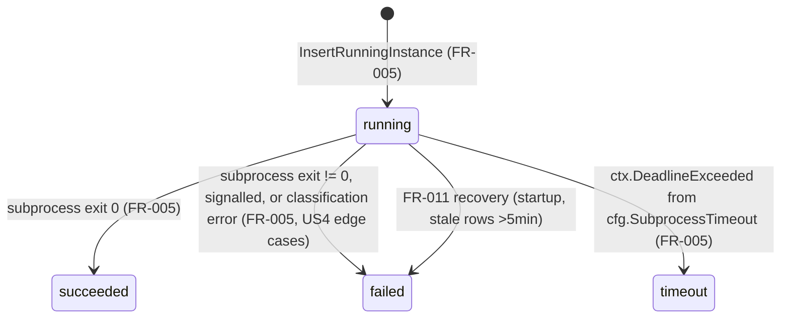

# Data model: M1 — event bus and supervisor core

**Phase**: 1 (design)
**Authoritative schema**: [`specs/_context/m1-context.md`](../_context/m1-context.md) §"Data model for M1". This file does not duplicate the SQL; it documents the Go-side mapping, state transitions, and invariants the implementation must uphold.

## Source of truth

The SQL in m1-context.md is the source of truth. This includes:
- Four tables: `departments`, `tickets`, `event_outbox`, `agent_instances`.
- Two indexes: `idx_event_outbox_unprocessed` (partial on `processed_at IS NULL`) and `idx_agent_instances_running` (partial on `status = 'running'`).
- One trigger function and trigger: `emit_ticket_created` and `ticket_created_emit`.

Goose migrations in `migrations/` are the enforcement mechanism. sqlc-generated types in `supervisor/internal/store` are the Go-side mirror.

## Entity summary and Go mapping

| Entity | Table | Go type (sqlc) | Package |
|--------|-------|----------------|---------|
| Department | `departments` | `store.Department` | `internal/store` |
| Ticket | `tickets` | `store.Ticket` | `internal/store` |
| Event outbox entry | `event_outbox` | `store.EventOutbox` | `internal/store` |
| Agent instance | `agent_instances` | `store.AgentInstance` | `internal/store` |

No hand-written mirror types in domain packages; consumers use the generated structs directly. Domain packages define *method receivers or helper types* on top where useful (e.g. `concurrency.CapResult{Cap, Running, Allowed}` which holds `int`s from two underlying queries; not a row type).

## Status enumeration (`agent_instances.status`)

The column is `TEXT NOT NULL`; invariant on the Go side is that only four string literals may be written:

```go
const (
    StatusRunning   = "running"
    StatusSucceeded = "succeeded"
    StatusFailed    = "failed"
    StatusTimeout   = "timeout"
)
```

Lives in `internal/spawn` (producer) and is consumed as a literal elsewhere. No Go `iota` enum — sqlc returns strings and the comparisons happen in SQL or against these constants.

## State transitions for `agent_instances`



Invariants:
- Every transition from `running` sets `finished_at = NOW()` and `exit_reason` in the same `UPDATE`.
- Transitions only happen via `store.UpdateInstanceTerminal` (normal exit) or `store.RecoverStaleRunning` (startup recovery). No other code path writes `status`.
- No transition out of a terminal state. A row in `succeeded`, `failed`, or `timeout` is immutable thereafter.

## `exit_reason` vocabulary

Free-text in SQL; Go-side values the supervisor writes:

| Situation | `exit_reason` |
|-----------|---------------|
| Subprocess exited 0 | `"exit_code_0"` |
| Subprocess exited non-zero | `"exit_code_N"` with actual N |
| Subprocess signalled | `"signal_<NAME>"` e.g. `"signal_SIGKILL"` |
| `ctx.DeadlineExceeded` (subprocess timeout) | `"timeout"` |
| SIGTERM forwarded during shutdown, exited clean | `"supervisor_shutdown"` |
| SIGKILL escalated during shutdown | `"supervisor_shutdown_sigkill"` |
| FR-011 startup recovery | `"supervisor_restarted"` |

Tests in `internal/spawn/lifecycle_test.go` assert specific strings; the above table is the public contract.

## Invariants enforced in Go

1. **One `agent_instances` row per event** (FR-006, SC-002). Enforced by:
   - `spawn.Spawn` calling `LockEventForProcessing` first and returning early if `processed_at IS NOT NULL`.
   - The terminal transaction being `UPDATE agent_instances … WHERE id = $running_row_id` AND `UPDATE event_outbox SET processed_at=NOW() WHERE id=$event_id AND processed_at IS NULL`.
2. **`running` rows never outnumber `concurrency_cap` by more than one per department** (SC-003). Enforced by `internal/concurrency.CheckCap` before spawn + single-dispatcher discipline; the +1 race window is the documented cost of not using `SELECT FOR UPDATE`.
3. **Events are never lost across reconnect** (US3). Enforced by FR-007's fallback poll running before LISTEN on startup and on every reconnect.
4. **Stale `running` rows are reconciled before new work** (FR-011). Enforced by `recovery.RunOnce` running before the initial fallback poll.
5. **A deleted department cannot block work** (spec edge case). Enforced by `spawn.Spawn` catching `pgx.ErrNoRows` on the department lookup and running a short transaction that marks `event_outbox.processed_at = NOW()` without writing an `agent_instances` row. The supervisor logs at error level with `slog` field `reason="department_missing"` plus `event_id` / `ticket_id` / `department_id`; nothing is written to the `exit_reason` column because no row exists to hold it.

## Payloads

### pg_notify payload (`work.ticket.created`)

```json
{"event_id": "<uuid>"}
```

Only `event_id` is transmitted via NOTIFY per m1-context.md "pg_notify contract" to stay under Postgres' 8 KiB payload limit. The full event row is fetched via `GetEventByID`.

### `event_outbox.payload` (JSONB)

Written by the `emit_ticket_created` trigger:

```json
{
  "ticket_id": "<uuid>",
  "department_id": "<uuid>",
  "created_at": "<iso8601>"
}
```

The supervisor parses this into `store.TicketCreatedPayload` (a hand-written struct in `internal/events` — JSONB decoding happens once per event, not per access).

## UUID handling

- All UUIDs in the schema are `uuid.UUID` in Go (from `github.com/google/uuid`, transitively via pgx).
- **Open consideration**: pgx v5's native UUID type (`[16]byte`) avoids the separate import. If sqlc is configured to emit `pgtype.UUID`, no third-party UUID dep is needed. The plan leaves this choice to sqlc's config — the decision point is a sqlc.yaml knob, not a spec-level one.

## Timestamp discipline

- All timestamps are `TIMESTAMPTZ` in SQL and `time.Time` in Go.
- `created_at` is set by SQL `DEFAULT NOW()`; Go never writes it.
- `started_at` is set by `InsertRunningInstance` via `DEFAULT NOW()` in the column definition.
- `finished_at` is set by the terminal `UPDATE`; Go writes `time.Now().UTC()` for audit-log clarity.
- `processed_at` is set via `NOW()` in SQL; Go never writes it from code other than inside a transaction where the update is literally `processed_at = NOW()`.

## Migration order

1. `20260421000001_initial_schema.sql` — tables + indexes.
2. `20260421000002_event_trigger.sql` — `emit_ticket_created` function + `ticket_created_emit` trigger.

The order matters: the trigger references `event_outbox`, so the schema migration must land first. Both run under `supervisor --migrate` via goose.

## Schema non-goals (M1)

- No soft deletes.
- No audit/history tables.
- No foreign keys to a future `users` or `agents` table.
- No `updated_at` column — terminal states are a rewrite of `status`/`finished_at`/`exit_reason` and observation is by row, not by audit trail.
- No JSONB schema validation constraints (trigger produces a known shape; validator belongs in application code if ever needed).
