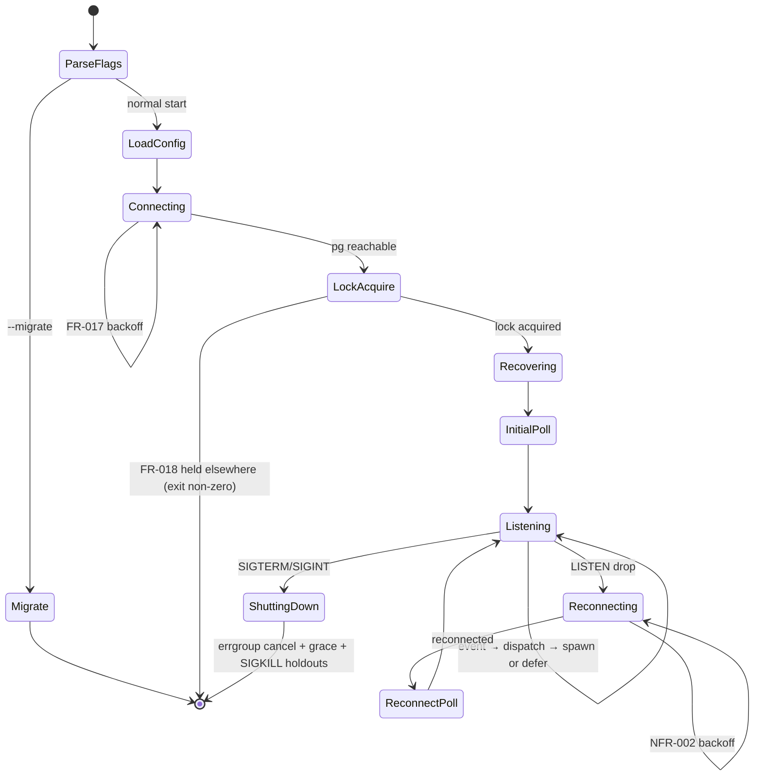

# Implementation plan: M1 — event bus and supervisor core

**Branch**: `001-m1-event-bus` | **Date**: 2026-04-21 | **Spec**: [spec.md](./spec.md)
**Input**: Feature specification from `/specs/m1-event-bus/spec.md`
**Binding context**: [`specs/_context/m1-context.md`](../_context/m1-context.md), [`AGENTS.md`](../../AGENTS.md) §§"Activate before writing code" + "Stack and dependency rules" + "Concurrency discipline", [`RATIONALE.md`](../../RATIONALE.md) §9 and §11, [`constitution.md`](../../.specify/memory/constitution.md)

## Summary

Ship a single static Go binary that listens on Postgres `pg_notify`, spawns bounded-parallelism subprocesses on `work.ticket.created` events, tracks them in `agent_instances`, and survives connection drops and restarts without losing events. Technical approach: a `main` goroutine owns a root context and wires five subsystems through `errgroup.WithContext` — connection manager, event dispatcher, fallback poller, subprocess manager, and health server — each accepting a derived context and exiting on cancellation. One dedicated `*pgx.Conn` handles LISTEN and the FR-018 advisory lock; a separate `*pgxpool.Pool` handles every other query. sqlc generates query types from SQL in `migrations/queries/`; goose manages schema migrations via an in-binary `--migrate` subcommand.

## Technical context

**Language/Version**: Go 1.23+
**Primary dependencies**: `github.com/jackc/pgx/v5`, `github.com/jackc/pgx/v5/pgxpool`, `golang.org/x/sync/errgroup`, `log/slog` (stdlib), `github.com/pressly/goose/v3`, `github.com/stretchr/testify` (test-only), `github.com/testcontainers/testcontainers-go` (test-only). sqlc is a build-time code generator, not a runtime import.
**Storage**: PostgreSQL 17+ (for `gen_random_uuid`, JSONB, partial indexes, `LISTEN`/`NOTIFY`, advisory locks).
**Testing**: stdlib `testing` + testify for assertions + testcontainers-go for integration/chaos; ephemeral Postgres containers per suite.
**Target platform**: Linux server (Hetzner + Coolify); single static binary via `CGO_ENABLED=0 go build`.
**Project type**: CLI/daemon (one package produces one binary).
**Performance goals**: NFR-007 1s to LISTEN on reachable Postgres; poll cycle at default 5s drains up to 100 rows (NFR-009); per-department concurrency cap enforcement with at most +1 race window (SC-003).
**Constraints**: locked dependency list per AGENTS.md; no CGO; no managed cloud services (constitution principle XI); structured slog output to stdout only; single-instance-per-database enforced via advisory lock (FR-018).
**Scale/scope**: single-operator system; order-of-magnitude expectations are tens of departments, single-digit concurrency per department, event rates well under the 100-rows-per-5s fallback poll ceiling. Higher throughput is a post-M1 tunability concern (NFR-009 note).

## Constitution check

*Gate: must pass before Phase 0 research. Re-checked after Phase 1 design.*

| Principle | Compliance |
|-----------|------------|
| I. Postgres is sole source of truth; pg_notify is the bus | Pass — no secondary state store; events flow through `event_outbox` with `processed_at` dedupe. |
| II. MemPalace is sole memory store | N/A — MemPalace deferred to M2; M1 introduces no alternative. |
| III. Agents are ephemeral | Pass — every `agent_instances` row represents one spawn that runs to completion and dies. |
| IV. Soft gates on memory hygiene | N/A — M1. |
| V. Skills from skills.sh | N/A — M1. |
| VI. Hiring is UI-driven | N/A — M1. |
| VII. Go supervisor with locked deps | Pass — see Technical context; sole additions are the already-named `pressly/goose/v3` and `pgx/v5/pgxpool`, both already permitted by AGENTS.md "Stack and dependency rules". |
| VIII. Every goroutine accepts context | Pass — `errgroup.WithContext` at the root, derived contexts everywhere, no bare `go func()`. |
| IX. Narrow specs per milestone | Pass — plan scope is the spec's FR-001…FR-018 only; M2+ items explicitly deferred below. |
| X. Per-department concurrency caps | Pass — `internal/concurrency` reads `departments.concurrency_cap` before every spawn. |
| XI. Self-hosted on Hetzner | Pass — Dockerfile targets Hetzner+Coolify; no managed-cloud calls. |

No violations → Complexity tracking section intentionally empty.

## Project structure

### Documentation (this feature)

```text
specs/m1-event-bus/
├── spec.md              # locked after clarify
├── plan.md              # this file
├── research.md          # Phase 0 output (decisions + rationale)
├── data-model.md        # Phase 1 output (Go types + invariants)
├── quickstart.md        # Phase 1 output (build/run locally)
├── contracts/           # Phase 1 output
│   ├── pg-notify.md     # work.ticket.created payload + dedupe contract
│   ├── health-endpoint.md
│   ├── cli.md           # --version / --help / --migrate shape
│   └── subprocess-output.md
└── tasks.md             # produced later by /speckit.tasks
```

### Source code (repository root)

The repo layout follows the target in AGENTS.md "Repository layout (target)". M1 populates `supervisor/` and `migrations/`.

```text
garrison/
├── supervisor/
│   ├── cmd/supervisor/
│   │   └── main.go                 # flags, signal handling, errgroup root
│   ├── internal/
│   │   ├── config/                 # typed Config struct + env-var loader
│   │   ├── pgdb/                   # pgxpool factory + dedicated LISTEN conn + advisory lock
│   │   ├── store/                  # sqlc-generated query code (do not hand-edit)
│   │   ├── events/                 # static dispatcher + LISTEN loop + fallback poll + reconnect
│   │   ├── concurrency/            # cap accounting (COUNT running vs cap)
│   │   ├── spawn/                  # subprocess lifecycle + agent_instances writes
│   │   ├── recovery/               # startup stale-row query
│   │   └── health/                 # HTTP server + /health handler + shared health state
│   ├── sqlc.yaml
│   ├── go.mod
│   ├── go.sum
│   ├── Dockerfile                  # CGO_ENABLED=0, single static binary
│   └── Makefile                    # build/test/run/migrate targets
└── migrations/
    ├── 20260421000001_initial_schema.sql   # goose-managed schema
    ├── 20260421000002_event_trigger.sql    # pg_notify trigger function
    └── queries/
        ├── departments.sql
        ├── tickets.sql
        ├── event_outbox.sql
        └── agent_instances.sql
```

**Structure decision**: single-binary Go daemon under `supervisor/`; SQL artefacts under repo-root `migrations/` so that a future Drizzle-based dashboard can derive from the same SQL (AGENTS.md "Repository layout (target)"). sqlc generates into `supervisor/internal/store`; the generated files are tracked in git so a clean clone can `go build` without running sqlc first.

## Package layout (decision 1)

One paragraph per package. Each paragraph states what the package owns and what it does not own.

### `cmd/supervisor`

Owns the binary entry point. Parses CLI flags (`--version`, `--help`, `--migrate`), loads `internal/config`, constructs the `errgroup.WithContext` at the top of `Run`, subscribes to `SIGTERM`/`SIGINT`, and wires every subsystem into the group. On `--migrate`, delegates to goose and exits. On normal startup, delegates to `internal/pgdb` for the initial connect (per FR-017), acquires the FR-018 advisory lock, calls `internal/recovery`, starts the fallback poll once, then starts the LISTEN loop, fallback poll ticker, subprocess manager, and health server concurrently. Does not contain business logic; it is orchestration glue only.

### `internal/config`

Owns environment-variable loading into a typed `Config` struct and validation at startup. Fails fast with a clear error if a required var is missing or a duration is invalid. Exposes `Load() (*Config, error)` and the struct itself. Does not own defaults for operationally-adjustable values in a way that hides them — every default is a constant in this package with a comment citing the spec requirement that pinned it.

### `internal/pgdb`

Owns Postgres connectivity: a `*pgxpool.Pool` for general queries and a dedicated `*pgx.Conn` for LISTEN. Exposes a `Connect(ctx, cfg) (*Pool, *ListenConn, error)` constructor that applies the FR-017 startup backoff, and an `AcquireAdvisoryLock(ctx, conn) error` that wraps `pg_try_advisory_lock(0x6761727269736f6e)` and returns a typed `ErrAdvisoryLockHeld` on contention. Does not own LISTEN semantics (that belongs in `internal/events`); only owns the connection primitives.

### `internal/store`

Owns nothing hand-written. Target directory for sqlc-generated Go code. All files are regenerated on `make sqlc`. Consumers (events, spawn, concurrency, recovery) import types and query methods from here. Do not edit by hand.

### `internal/events`

Owns the event dispatcher, the LISTEN loop, the fallback poll loop, the reconnect backoff state machine, and the startup ordering. Exposes `NewDispatcher(handlers map[string]Handler) *Dispatcher` with handler routing frozen at construction (decision 3, static). Exposes `Run(ctx context.Context, deps Deps) error` that executes the canonical startup sequence (FR-007 + FR-011 + FR-017 + FR-018 interlocking): connect → advisory lock → recovery → initial fallback poll → LISTEN. On reconnect, repeats the same sequence minus the advisory lock (which is already held on the surviving listener state machine's next instance). Does not own subprocess lifecycle or concurrency accounting; it decides *whether* to hand an event to the subprocess manager and *when*, not *how* to run it.

### `internal/concurrency`

Owns the cap-accounting query and the cap-check semantics. Exposes `CheckCap(ctx, tx, departmentID uuid.UUID) (allowed bool, cap int, running int, err error)` wrapping the `COUNT(*) FROM agent_instances WHERE department_id=$1 AND status='running'` query and the `concurrency_cap` read. Does not own the decision to defer an event — that is `internal/events`' choice based on this package's return value. Does not own advisory locking for concurrency (M1 accepts the documented +1 race window per m1-context.md "Concurrency accounting").

### `internal/spawn`

Owns the subprocess lifecycle: command-template substitution (both env-var + Go-side literal replacement per the gap-2 decision), `exec.CommandContext` launch with timeout-derived context, stdout/stderr line-buffered scanning into slog records, SIGTERM → 5s wait → SIGKILL on context cancellation (FR-010), and the `agent_instances` row transitions (insert running → update terminal with `finished_at` and `exit_reason`). Exposes `Spawn(ctx context.Context, ev Event) error`. Owns writing the `agent_instances` terminal row and the corresponding `event_outbox.processed_at` update in one transaction (FR-006). Does not own the concurrency check (that happens in `internal/events` before calling `Spawn`).

### `internal/recovery`

Owns the FR-011 startup recovery query and nothing else. Exposes `RunOnce(ctx, pool) (int, error)` returning the count of rows reconciled. Runs the query in "Graceful shutdown" of m1-context.md. Does not own any continuous lifecycle — it runs exactly once per supervisor startup, between advisory-lock acquisition and the initial fallback poll.

### `internal/health`

Owns the HTTP server, the `/health` handler, and the shared health state read by the handler. Exposes `NewServer(cfg, state *State) *http.Server` and a `State` struct with atomics for `LastPollAt time.Time`, `LastPingOK bool`, and `LastPingAt time.Time`. The handler returns `200` iff a fresh ping via `state.PingNow(ctx)` succeeds and `time.Since(LastPollAt) <= 2 * cfg.PollInterval` (per FR-016). Binds `0.0.0.0:$port` per the Clarifications decision; no authentication. Does not own population of `State` — `internal/events` writes to it on each successful poll and the ping is an on-demand query issued by the handler via a shared pool handle.

## Config (decision 2)

Env vars only; typed `config.Config` struct validated at startup. No file-based config (confirms FR-013).

| Env var | Type / default | Source requirement |
|---------|----------------|--------------------|
| `GARRISON_DATABASE_URL` | string, required | FR-001 (connection) |
| `GARRISON_FAKE_AGENT_CMD` | string, required | m1-context.md "Subprocess contract" |
| `GARRISON_POLL_INTERVAL` | duration, default `5s`, min `1s` | NFR-001 |
| `GARRISON_SUBPROCESS_TIMEOUT` | duration, default `60s` | NFR-003 |
| `GARRISON_SHUTDOWN_GRACE` | duration, default `30s` | NFR-004 |
| `GARRISON_HEALTH_PORT` | uint16, default `8080` | FR-016 |
| `GARRISON_LOG_LEVEL` | enum `debug\|info\|warn\|error`, default `info` | NFR-008 |

`Config` struct fields mirror these one-to-one with Go-native types (`time.Duration`, `uint16`, custom `slog.Level`). `Load()` fails non-zero at startup on: missing required var, non-positive durations, `GARRISON_POLL_INTERVAL < 1s`, invalid log level, unparseable URL. Reconnect backoff (NFR-002), per-subprocess SIGTERM-grace (NFR-005), and recovery window (NFR-006) are **not** env-configurable in M1; they are exported constants in `internal/events` and `internal/spawn` and `internal/recovery` respectively.

## Supervisor lifecycle and state machine



Top-level wiring in `cmd/supervisor`: `errgroup.WithContext(rootCtx)` runs five functions concurrently, each accepting `ctx`:

1. `events.Run(ctx, deps)` — owns the Listening/Reconnecting state transitions above.
2. `spawn.Run(ctx, deps)` — consumes events from `events` via a channel and runs subprocesses.
3. `pollTicker.Run(ctx, deps)` — ticker-driven fallback poll at `cfg.PollInterval`; writes `state.LastPollAt` on each cycle.
4. `health.Serve(ctx, server)` — HTTP server with graceful-shutdown on ctx cancel.
5. `signals.Watch(ctx, cancel)` — translates `SIGTERM`/`SIGINT` into root-context cancellation.

On cancellation, `errgroup.Wait` returns; `main` enforces the NFR-004 total shutdown grace with a hard deadline and exits 0 unless any subprocess required a SIGKILL (FR-010/NFR-005 → exit non-zero if any SIGKILL was issued).

## pg_notify listener connection lifecycle

The dedicated `*pgx.Conn` is owned by `internal/events.listener`. Lifecycle:

1. **Initial connect** (FR-017): acquire the dedicated conn with NFR-002 backoff against the config's database URL. While retrying, the pool-backed Postgres connection used by `/health` ping is **not yet open**, so `/health` stays 503 (the ping errors out).
2. **Advisory lock** (FR-018): `pg_try_advisory_lock(0x6761727269736f6e)` on the dedicated conn. Fail-fast with `ErrAdvisoryLockHeld` → non-zero exit.
3. **Recovery** (FR-011): `internal/recovery.RunOnce` against the pool.
4. **Initial fallback poll**: one call to `events.pollOnce(ctx)` before LISTEN. Writes `state.LastPollAt`.
5. **LISTEN**: `conn.Exec(ctx, "LISTEN work.ticket.created")`, then `for { conn.WaitForNotification(ctx); dispatch(notification) }`.
6. **On error from `WaitForNotification`**: classify via `pgconn.Timeout`/`IsAdminShutdown`. Retry loop → close conn, reconnect with NFR-002 backoff, run recovery's partial equivalent (see note), run `pollOnce`, then re-LISTEN. Backoff resets on success.
7. **On root-context cancel**: `conn.Close(ctx)` releases the advisory lock implicitly (advisory locks are session-bound).

**Note on reconnect path and recovery**: FR-011 recovery runs once per process start, not per reconnect — stale rows are only produced by a process that exited. A reconnect inside one process does not create stale rows. The canonical reconnect sequence is therefore `backoff → connect → pollOnce → LISTEN` (no recovery).

## Event dispatcher (decision 3)

Static. Build the route table once in `cmd/supervisor` and pass it to `events.NewDispatcher`:

```go
// conceptual; real code lives in cmd/supervisor
handlers := map[string]events.Handler{
    "work.ticket.created": ticketCreatedHandler,
}
dispatcher := events.NewDispatcher(handlers)
```

After construction, the map is read-only. FR-014 requires a clear startup error if a notification arrives for an unregistered channel; because the dispatcher is static and M1 LISTENs on exactly one channel, the only way this fires is if someone later adds a LISTEN call without updating the map — a maintenance bug we want to surface loudly. The dispatcher logs at error level with the offending `channel` and drops the notification; the fallback poll will not pick it up because it selects by `processed_at IS NULL` across all channels, so the plan adds a defensive invariant: **every channel the supervisor polls must have a handler registered, enforced at startup by cross-checking `handlers` against a constant list of known M1 channels**.

## Concurrency accounting

Per m1-context.md "Concurrency accounting" and spec FR-003, the sequence before each spawn is:

```sql
SELECT concurrency_cap FROM departments WHERE id = $1;
SELECT COUNT(*) FROM agent_instances WHERE department_id = $1 AND status = 'running';
```

If `running < cap`, proceed to spawn. Otherwise leave `event_outbox.processed_at` NULL and return — the fallback poll will observe the row next cycle.

**Race window**: the documented +1 race in m1-context.md applies because two concurrent goroutines in the supervisor could both read `running < cap` before either INSERTs a `running` row. M1 accepts this because a single supervisor process with a single dispatch goroutine processes events serially per `events.Run` iteration. The spawn goroutine is `errgroup.Go`'d per event, but the gate check happens on the dispatcher goroutine before the spawn goroutine starts. SC-003's `cap + 1` observation budget covers the remaining window between gate-check and INSERT.

**Cap=0 semantics** (FR-003): if `cap == 0`, `running < cap` is always false, events always defer. No special case in code.

## Subprocess lifecycle manager

Per m1-context.md "Subprocess contract" and spec FR-004/FR-005/FR-010/FR-015. Sequence per event:

1. Look up department (for slug/name used in logs) and ticket from the event's `event_id`.
2. Run concurrency gate (`internal/concurrency.CheckCap`). Defer if blocked.
3. Command template substitution (decision 7 + gap 2):
   - Go-side replacement of literal `$TICKET_ID` and `$DEPARTMENT_ID` tokens in the argv produced by shell-splitting `GARRISON_FAKE_AGENT_CMD` (use `github.com/google/shlex` — **open question: this is one dep outside the locked list; propose accepting it, else implement minimal whitespace-split with documented limitations**).
   - Set `TICKET_ID` and `DEPARTMENT_ID` as env vars on the subprocess in addition.
4. `INSERT INTO agent_instances (status='running', started_at=NOW(), ...)` → returning `id`.
5. `ctx, cancel := context.WithTimeout(rootCtx, cfg.SubprocessTimeout)` → `exec.CommandContext(ctx, argv[0], argv[1:]...)`. Set `Stdout`/`Stderr` to `io.Pipe` halves; spawn two goroutines per stream running `bufio.Scanner` and emitting one `slog` record per line with `stream="stdout"|"stderr"` and the domain fields attached via `slog.With`.
6. Wait for exit in a goroutine; on exit, classify: clean `nil` → `succeeded`; `ctx.Err() == context.DeadlineExceeded` → `timeout`; signal/non-zero → `failed`. Set `exit_reason` accordingly.
7. Open a transaction: `UPDATE agent_instances SET status=..., finished_at=NOW(), exit_reason=...` AND `UPDATE event_outbox SET processed_at=NOW() WHERE id=$event_id AND processed_at IS NULL` — both in the same tx (FR-006). Idempotency: the `AND processed_at IS NULL` clause makes the event-side update a no-op on replay, and the agent_instance update is bound to the unique row already inserted so re-entry cannot duplicate.
8. On context cancellation mid-run (shutdown): `cmd.Process.Signal(syscall.SIGTERM)`, wait up to 5s (NFR-005), then `cmd.Process.Kill()` (SIGKILL). Record `exit_reason="supervisor_shutdown"` and flip status to `failed` or `timeout` based on how the child exited.

**Dedupe on handling** (FR-006, edge case in spec): before the transaction in step 7, an earlier notification may have already marked `processed_at`. To prevent a duplicate `agent_instances` row in the LISTEN-then-poll race, the very first step of handling is `SELECT processed_at FROM event_outbox WHERE id=$event_id FOR UPDATE` inside a short transaction; if already set, return without spawning. This is the idempotency mechanism spec edge-case "LISTEN after poll" references.

## Recovery on startup

`internal/recovery.RunOnce(ctx, pool)` executes (verbatim from m1-context.md "Graceful shutdown"):

```sql
UPDATE agent_instances
SET status = 'failed', exit_reason = 'supervisor_restarted', finished_at = NOW()
WHERE status = 'running' AND started_at < NOW() - INTERVAL '5 minutes';
```

The 5-minute window is the NFR-006 constant, pinned in an exported `RecoveryWindow = 5 * time.Minute`. RunOnce returns the affected-row count for logging. It runs exactly once per process, after advisory-lock acquisition and before the initial fallback poll.

## /health endpoint

Per FR-016 and the Clarifications binding. The handler:

```text
GET /health  →  200 if LastPingOK && time.Since(LastPollAt) <= 2*PollInterval, else 503
```

`LastPingOK` is refreshed synchronously inside the handler: the handler issues `SELECT 1` via the shared pool (timeout 500ms), captures the result, updates `LastPingOK` and `LastPingAt` atomically, and writes the status. `LastPollAt` is written by the fallback poller on each cycle. Binding: `0.0.0.0:$cfg.HealthPort`, no authentication. On root-context cancel, `http.Server.Shutdown` is called with `cfg.ShutdownGrace` budget.

## sqlc layout (decision 4)

- `supervisor/sqlc.yaml` at the binary root.
- Engine: `postgresql`. Schema: `migrations/*.sql`. Queries: `migrations/queries/*.sql`. Output: `supervisor/internal/store`.
- Package: `store`. Emit JSON tags: no. Emit pointers for nullable: yes.

M1 queries (each lives in the named file under `migrations/queries/`):

**`departments.sql`**
- `GetDepartmentByID` — single row by UUID.
- `InsertDepartment` — for test seeding only, but lives in production code because removing test-only files from the generated package is churny.

**`tickets.sql`**
- `GetTicketByID` — single row.
- `InsertTicket` — test seeding only; in production the operator inserts via psql, but including it here lets integration tests stay in Go.

**`event_outbox.sql`**
- `GetEventByID` — single row; the LISTEN notification payload carries only `event_id` per m1-context.md "pg_notify contract".
- `SelectUnprocessedEvents` — the FR-007 fallback poll query shape.
- `LockEventForProcessing` — `SELECT ... FOR UPDATE` variant used by `spawn` before the transactional terminal write (dedupe).
- `MarkEventProcessed` — `UPDATE event_outbox SET processed_at=NOW() WHERE id=$1 AND processed_at IS NULL`.

**`agent_instances.sql`**
- `InsertRunningInstance` — creates a `status='running'` row, returns `id`.
- `UpdateInstanceTerminal` — sets status, finished_at, exit_reason.
- `CountRunningByDepartment` — for `internal/concurrency`.
- `RecoverStaleRunning` — FR-011 recovery.

sqlc-generated code is committed to the repo so `go build` works on a fresh clone without the sqlc CLI.

## Migrations (decision 5)

Tool: **goose**, embedded via `github.com/pressly/goose/v3`. The `--migrate` subcommand calls `goose.UpContext(ctx, db, "migrations")` then exits 0. No separate goose binary dependency; operators need only the supervisor binary and a reachable Postgres.

File naming: `migrations/<YYYYMMDDHHMMSS>_<slug>.sql` (goose default). M1 ships two migrations:

- `20260421000001_initial_schema.sql` — tables from m1-context.md "Data model for M1" (`departments`, `tickets`, `event_outbox`, `agent_instances`) and the two indexes.
- `20260421000002_event_trigger.sql` — `emit_ticket_created` function and the `ticket_created_emit` trigger from m1-context.md.

Goose migration files use `-- +goose Up` / `-- +goose Down` sentinels. `Down` is best-effort (drop the trigger and tables); data is considered disposable in M1.

## Logging fields (decision 6)

Handler: `slog.NewJSONHandler(os.Stdout, &slog.HandlerOptions{Level: cfg.LogLevel})`. Writer is stdout only; container runtimes collect from stdout. No file destinations, no rotation (Coolify/Docker handle this).

Baseline fields attached at logger construction:

| Field | Value |
|-------|-------|
| `service` | `"supervisor"` |
| `version` | injected at build via `-ldflags="-X main.version=..."` |
| `pid` | `os.Getpid()` |

Domain fields attached via `slog.With` as they come into scope:

| Field | When present |
|-------|--------------|
| `event_id` | Any log in the event-handling path |
| `channel` | Any LISTEN/dispatch/poll record |
| `ticket_id` | After event resolution |
| `department_id` | After event resolution |
| `agent_instance_id` | After `InsertRunningInstance` |
| `stream` | Subprocess output records only (`"stdout"` / `"stderr"`) |
| `exit_code` / `exit_signal` | Subprocess terminal records only |

## Subprocess output (decision 7)

Line-buffered streaming to slog; one record per line with domain fields + `stream`. No per-invocation files (FR-015). Implementation notes:

- One goroutine per stream (`stdout`, `stderr`), each calling `bufio.Scanner.Scan()` in a loop.
- Scanner buffer limit raised to 1 MiB via `scanner.Buffer(make([]byte, 64*1024), 1024*1024)` to tolerate long lines without truncation-panics. Lines longer than 1 MiB are logged as `level=warn stream=<>  msg="line exceeded 1MiB buffer" truncated=true`.
- Both goroutines are members of the per-spawn `errgroup` so their exit is part of "subprocess finished" bookkeeping.
- Encoding is assumed UTF-8; non-UTF-8 bytes pass through slog's JSON-escape.

## Dockerfile and Makefile

### Dockerfile (`supervisor/Dockerfile`)

Six-line static-binary image, per RATIONALE §9 and AGENTS.md "Deployment":

```dockerfile
FROM golang:1.23-alpine AS build
WORKDIR /src
COPY . .
RUN CGO_ENABLED=0 go build -ldflags="-X main.version=$(git describe --tags --always)" -o /out/supervisor ./cmd/supervisor
FROM gcr.io/distroless/static-debian12
COPY --from=build /out/supervisor /supervisor
ENTRYPOINT ["/supervisor"]
```

### Makefile (`supervisor/Makefile`)

Targets (names fixed so downstream agents don't re-invent them):

| Target | Action |
|--------|--------|
| `build` | `CGO_ENABLED=0 go build -o bin/supervisor ./cmd/supervisor` |
| `test` | `go test ./...` |
| `test-integration` | `go test -tags=integration ./...` (testcontainers tests live behind a build tag) |
| `test-chaos` | `go test -tags=chaos ./...` |
| `sqlc` | `sqlc generate` (config at `sqlc.yaml`) |
| `migrate` | `./bin/supervisor --migrate` |
| `run` | `./bin/supervisor` |
| `docker` | `docker build -t garrison/supervisor:dev .` |
| `lint` | `go vet ./... && gofmt -l .` |
| `clean` | `rm -rf bin/` |

## Test plan

Test files named at the function level, grouped by what they verify. Build tags: `integration` for testcontainers-backed tests, `chaos` for fault-injection tests.

### Unit tests (no Postgres)

**`internal/config/config_test.go`**
- `TestLoadDefaults` — only `GARRISON_DATABASE_URL` and `GARRISON_FAKE_AGENT_CMD` set; all other fields equal documented defaults.
- `TestLoadRejectsSubSecondPoll` — `GARRISON_POLL_INTERVAL=500ms` → Load returns error.
- `TestLoadRejectsMissingRequired` — missing `GARRISON_DATABASE_URL` → Load returns error naming the missing var.
- `TestLoadRejectsInvalidLogLevel` — `GARRISON_LOG_LEVEL=chatty` → error.

**`internal/concurrency/cap_test.go`**
- `TestCheckCapAllowsUnderCap` — cap=3, running=2 → allowed=true.
- `TestCheckCapBlocksAtCap` — cap=3, running=3 → allowed=false.
- `TestCheckCapBlocksAtZero` — cap=0 → allowed=false (FR-003 pause semantics).

**`internal/events/dispatch_test.go`**
- `TestDispatchRoutesKnownChannel` — payload for `work.ticket.created` invokes the registered handler exactly once.
- `TestDispatchErrorsOnUnknownChannel` — unregistered channel → `ErrNoHandler` returned; no panic.
- `TestDispatchRejectsMalformedPayload` — payload missing `event_id` → error is logged and no handler invoked (FR-002 edge case).

**`internal/spawn/template_test.go`**
- `TestSubstituteLiteralTokens` — template `"echo $TICKET_ID $DEPARTMENT_ID"` yields the expected argv tokens after replacement.
- `TestSubstituteAlsoSetsEnv` — the returned `*exec.Cmd` has `TICKET_ID` and `DEPARTMENT_ID` in `Env`.
- `TestShlexRejectsUnterminatedQuote` — template `"sh -c 'oops"` returns a parse error before spawn.

**`internal/spawn/lifecycle_test.go`**
- `TestClassifyExitZero` — `*exec.Cmd` exits 0 → `succeeded`.
- `TestClassifyExitNonZero` — exit 7 → `failed`, `exit_reason` captures the code.
- `TestClassifyTimeout` — ctx deadline-exceeded → `timeout`.
- `TestClassifySIGKILL` — signaled with SIGKILL → `failed`, reason captures signal name.

### Integration tests (testcontainers-go Postgres, tag `integration`)

**`internal/store/store_integration_test.go`** (one file per sqlc query group is an option; single file keeps container reuse simple.)
- `TestInsertAndGetDepartment`, `TestSelectUnprocessedEvents`, `TestMarkEventProcessedIdempotent`, `TestRecoverStaleRunning`.

**`supervisor/integration_test.go`** (top-level, exercises the whole binary against a real container)
- `TestEndToEndTicketFlow` — spec US1 AC1: insert one ticket, observe one `agent_instances` row reach `succeeded`, `processed_at` set.
- `TestConcurrencyCapEnforced` — spec US2: cap=2, insert 3 tickets, observe at most 2 concurrently running, all three complete.
- `TestDeferredEventPickedUpOnPoll` — spec US2 AC2: a deferred event spawns when a slot frees after the fallback poll interval.
- `TestDepartmentNotExistMarksProcessed` — spec edge case: ticket referencing a deleted `department_id` → event marked processed, no spawn, error logged.
- `TestCapZeroPauses` — cap=0 leaves events unprocessed; raising cap releases them on next poll.
- `TestStartupFallbackPollBeforeListen` — insert an event with the supervisor stopped; start supervisor; event is processed within one poll interval. Validates Q4 clarification.
- `TestAdvisoryLockRejectsDoubleRun` — start one supervisor, try to start a second against the same DB, second exits non-zero quickly. Validates FR-018.
- `TestRecoveryMarksStaleRunning` — seed a `running` row with `started_at=now() - 10min`; start supervisor; row is `failed` before first new event.
- `TestHealthReturns200WhenReady` — after startup completes, `/health` returns 200; during the initial connect retry (Postgres paused), `/health` returns 503.

### Chaos tests (tag `chaos`)

**`supervisor/chaos_test.go`**
- `TestReconnectCatchesMissedEvents` — testcontainer Postgres is paused mid-run; 3 tickets inserted during the outage; unpause; all 3 complete within one poll interval after reconnect. Spec US3.
- `TestSIGKILLSubprocessRecordedFailed` — spawn a subprocess, SIGKILL the process externally, observe `agent_instances.status='failed'` with `exit_reason` containing the signal. Spec US4 edge case.
- `TestGracefulShutdownWithInflight` — long-running fake agent, send SIGTERM to supervisor; verify subprocess receives SIGTERM, exits, supervisor exits within `GARRISON_SHUTDOWN_GRACE`. Spec US4 AC1/AC2.

### Test coverage policy

Per m1-context.md "Testing requirements": meaningful coverage on concurrency and pg_notify paths; no coverage chasing on boilerplate. The test list above is the acceptance bar — the plan does not mandate a numeric percentage.

## Deferred decisions (explicit non-scope)

- Real Claude Code invocation — M2. The `spawn.Spawn` signature is stable; the implementation swap is internal to the package.
- MemPalace MCP wiring — M2.
- Multi-channel dispatch (anything beyond `work.ticket.created`) — M2+.
- Dashboard / UI concerns — M3.
- Per-agent-type concurrency sub-caps — post-M1 (RATIONALE §11 "Composable").
- Fallback poll batch-size tunability (NFR-009 is fixed at 100 for M1).
- `/metrics` endpoint — m1-context.md "Observability" defers to M2.
- Blue/green rolling deploys — disallowed per FR-018 clarification.

## Open questions surfaced by this plan

1. **`github.com/google/shlex` for command-template argv splitting** — one dependency outside the locked list. Alternatives: (a) accept the dep with a justification in the commit message per AGENTS.md soft rule; (b) implement whitespace-split with documented limitations (breaks quoted args with spaces, which matches the m1-context.md example `sh -c 'echo hello from $TICKET_ID; sleep 2'`). Plan's position: flag and propose (a); revert to (b) if the operator refuses.

2. **`os/signal` handling of SIGHUP** — spec covers SIGTERM and SIGINT (FR-009). Containers often also receive SIGHUP on restart. The plan proposes treating SIGHUP identically to SIGTERM (graceful shutdown) without calling this out as a spec requirement. Flag for operator decision; default is "treat as SIGTERM".

3. **`internal/events.Run` error-group ownership of the poll ticker** — the plan currently lists the poll ticker as a peer of `events.Run` in the top-level errgroup. An alternative is to nest it under `events.Run` so that reconnect logic owns both LISTEN and poll lifecycle together. The nested variant is cleaner but couples the two more tightly. Plan's position: keep as peers at the top level; events.Run notifies the poller of reconnect via a shared channel.

## Complexity tracking

No constitutional violations; section intentionally empty.

## Phase gate

**Phase 0** (`research.md`): decisions documented below — see the sibling file.
**Phase 1** artifacts: `data-model.md`, `contracts/*`, `quickstart.md` — see sibling files.
**Constitution re-check post-design**: all principles still pass; no new dependencies added beyond the two flagged open questions.
**Agent context**: `CLAUDE.md` updated between `<!-- SPECKIT START -->` and `<!-- SPECKIT END -->` markers to reference this plan.

Proceed with `/speckit.tasks` when this plan is approved.
